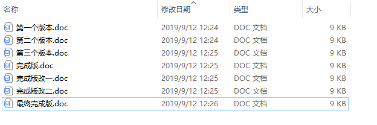
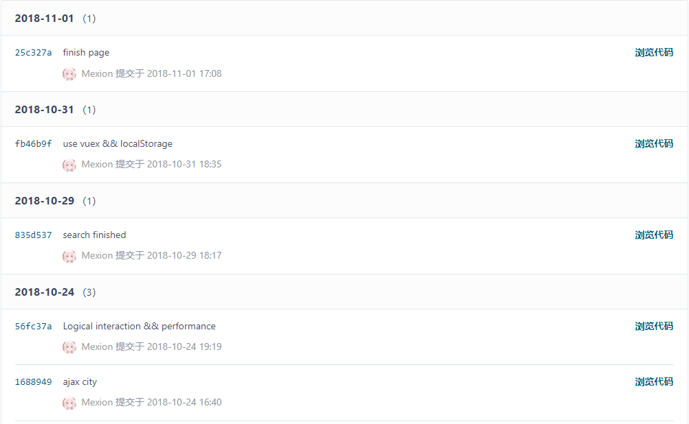
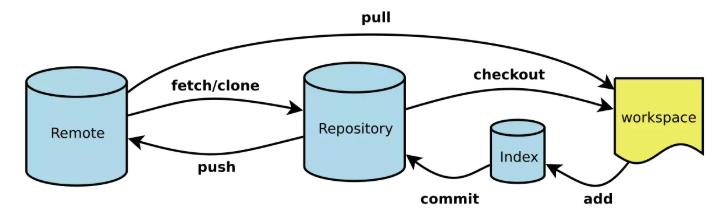
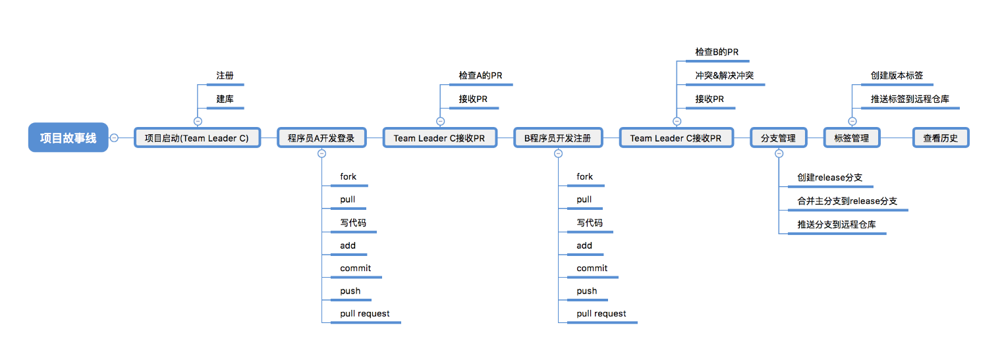
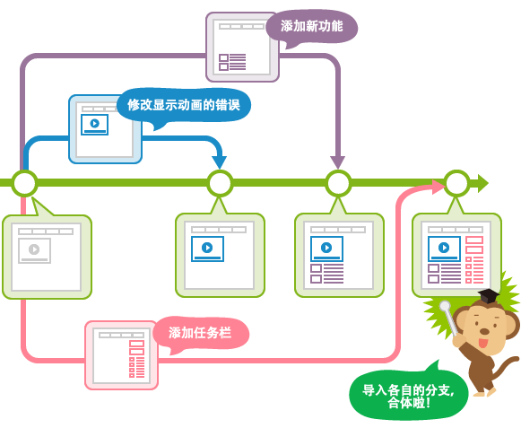
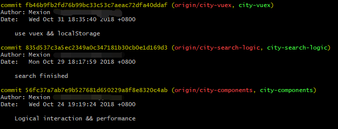
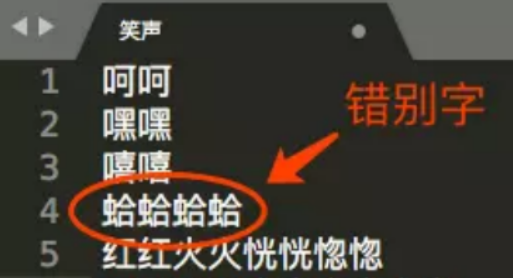
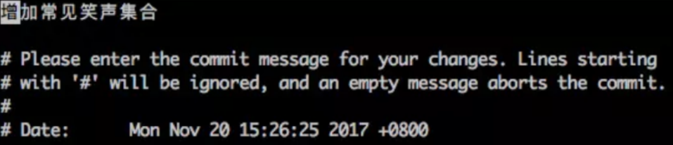

# Git入门

## 1.  什么是版本控制工具

要弄清楚什么是版本工具，就要弄清楚一个问题： 我们平时都是怎样去管理我们的文件版本的。
假如我们在工作中需要写一份文件，如下：



我们先完成第一个版本，在一段时间之后会写第二个版本，但是我们在写第二个版本时不想去删除第一个版本，这时我们会复制第一个版本并重命名为第二个版本，在第二个版本的基础上修改我们的内容，之后我们会以同样的方式去修改文件，这就会出现N个版本。

假如这份文件不是由我一个人完成的，这就涉及到团队协作的概念，假如我完成了第二个版本，这时交给其他人一份去共同完成，这时我自己也在现在的基础上进行了修改得到了第三个版本，但是其他人也修改了内容，这时候我们每个人手中都是不同的版本，每个人修改的内容其他人都不知道，就会极为麻烦。所以这样的协作方式有很大的缺点：

- 版本非常混乱，无法协同
- 各种版本需要人工合并
- 版本删除后无法找回

要解决这些问题，就出现了`版本管理`的工具，如CVS，SVN以及Git等，版本管理工具如下：



我们每一次提交都会被记录下来，生成不同的版本，我们可以清楚的看到修改的时间，修改的内容，也可以找回历史提交的版本，同时可以确保团队做到更好的协同。

## 2.什么是Git

知道了什么是版本管理工具，那么什么是Git？Git是版本管理工具的一种，管理工具分为本地版本管理工具、集中式版本管理工具、分布式版本管理工具：

- 本地版本管理： 只保存于本地的版本管理，不能和其他人协同管理。
- 集中式版本管理：将所有的文件保存在共同的服务器，在服务器进行管理，每个人提交和拉取都通过服务器进行（只有服务器一个仓库）。
- 分布式版本管理：同样有一个服务器仓库，但是每个人都可以创建一个独立的代码仓库用于管理，各种版本控制的操作都可以在本地完成。每个人修改的代码都可以推送合并到另外一个代码仓库中。

Git就是一种分布式版本管理工具。

### 2.1 Git的一些基本命令

| 序号 | 命令         | 命令作用                                                     |
| :--- | ------------ | ------------------------------------------------------------ |
| 1    | git init     | 新建一个目录，将其初始化为Git代码库                          |
| 2    | git clone    | 下载一个项目和它的整个代码历史                               |
| 3    | git pull     | 取回远程仓库的变化，并与本地分支合并                         |
| 4    | git add      | 添加当前目录的所有文件到暂存区（“.”号可暂存全部，也可以是文件名或目录） |
| 5    | git commit   | 提交暂存区到仓库区                                           |
| 6    | git push     | 推送代码到远程库                                             |
| 7    | git diff     | 显示暂存区和工作区的差异                                     |
| 8    | git checkout | 切换到指定分支，并更新工作区                                 |
| 9    | git fetch    | 下载远程仓库的所有变动                                       |
| 10   | git merge    | 合并指定分支到当前分支                                       |

上面的命令就可以应付工作中大多数情况。

## 3. Git是怎么运作的
### 3.1  工作区、暂存区、本地仓库、远程仓库
我们先来理解下Git 工作区、暂存区和版本库概念：

- 工作区（workspace）：在git管理下的正常目录都算是工作区。就是你平时存放项目代码的地方。
- 暂存区（index）：一般存放在 "/.git" 下的index文件（.git/index）中，用于临时存放你的改动，事实上它只是一个文件，保存即将提交的文件列表信息。
- 本地仓库（repository）：工作区有一个隐藏目录.git，这个不算工作区，而是Git的版本库。这里面有你提交的所有版本的数据，其中HEAD指向最新放入仓库的版本。
- 远程仓库（remote）：托管代码的服务器，可以简单的认为是一台电脑上的仓库专门用于集中管理数据，协同各个仓库间的数据。

### 3.2 Git工作流

下面是Git的工作流：



git的工作流程一般是这样的：

1. 在工作目录中添加、修改文件；
2. 将需要进行版本管理的文件放入暂存区域；
3. 将暂存区域的文件提交到git仓库。

因此，git管理的文件有三种状态：已修改（modified）,已暂存（staged）,已提交(committed)。

Git的一些操作说明：

- 在工作中，我们首先本地一般是没有代码的，这时我们可以使用`git clone`去远程仓库去拉取代码，远程仓库的所有文件和信息就会复制一份到本地仓库中来。
- 假如远程仓库又有了更新，我们想要得到远程仓库的所有更新，可以使用`git fetch`从远程仓库获取更新的代码合并到本地的仓库中。
- fetch命令只能将远程仓库的最新代码合并到本地仓库，但是我们需要手动将本地仓库的代码使用`git merge`到工作区，这时可以使用`git pull`命令简化操作，简单来说，`git pull = git fetch + git merge`。
- 假如我们有两条分支，需要在分支间切换，可以使用`git checkout`命令。
- 代码写完了，可以使用`git add`命令将代码暂存到暂存区，然后使用`git commit`命令将代码提交到本地仓库，这时本地仓库就有了现在代码的一个版本。
- 如果本地仓库的代码没问题了，可以使用`git push`命令将本地代码提交到远程仓库中。
- 缓存区只是一个暂存区，避免我们的一些失误，假如可以确保代码没问题，可以使用`git commit -a`简化add的操作。

## 4. Git的操作与命令

### 4.1 Init操作
Init操作可以创建一个空的Git仓库或者重新初始化现有的仓库。

### 4.2 Fork操作

Fork操作是从别人的远程仓库复制到自己的远程仓库，假如我们看到了一个开源的项目，我们想要参与这个开源项目，我们就可以从开源作者的远程仓库Fork一份到自己的远程仓库。Fork之后，我们就可以在此基础上随意修改，修改后如果要将自己的成果合并到开源项目的仓库，可以使用Pull Request操作。

### 4.3 Clone命令

Clone命令顾名思义，就是远程仓库克隆代码到自己本地，这时我们本地就有了一个与远程当前版本相同的仓库。具体操作是`git clone 远程仓库地址`，如`git clone git@github.com:Mexion/nuxtBlog.git`。如果这个项目自己没有相应的开发权限，修改后是不能将自己的修改推送到远程仓库的。

### 4.4 Pull命令

Pull命令可以在原有仓库的基础上从远程分支拉取最新的内容并合并到本地的工作区间。我们可以使用`git pull`或`git pull 远程仓库分支标签等`，在默认情况下运行`git pull`是拉取master的代码合并到本地工作区。需要是有开发权限的项目成员才能拉取。

### 4.5 Fetch命令

Fetch命令就是从远程仓库合并代码到自己的本地仓库。使用方法和Pull命令类似。

### 4.6 Merge命令

Merge命令可以将自己本地仓库的代码合并到工作区中，可以将指定分支合并到当前分支中。使用方法和Pull命令类似。

### 4.7 Add命令

Add命令可以将工作区中的文件添加到暂存区中，用法是`git add 文件名或目录名`，如果要暂存所有的文件，可以使用`git add .`，`.`号代表所有的文件。

### 4.8 Status命令

Status命令可以查看工作区和暂存区的状态。假如我们使用了Add命令将文件提交到了暂存区，就可以使用这个命令查看暂存区的状态，文件是否被正确添加到了暂存区。
git status相对来说是一个简单的命令，它简单的展示状态信息。输出的内容分为3个分类/组。
```
# On branch master
# Changes to be committed:  (已经在stage区, 等待添加到HEAD中的文件)
# (use "git reset HEAD <file>..." to unstage)
#
#modified: hello.py
#
# Changes not staged for commit: (有修改, 但是没有被添加到stage区的文件)
# (use "git add <file>..." to update what will be committed)
# (use "git checkout -- <file>..." to discard changes in working directory)
#
#modified: main.py
#
# Untracked files:(没有tracked过的文件, 即从没有add过的文件)
# (use "git add <file>..." to include in what will be committed)
#
#hello.pyc
```
#### 4.8.1 忽略文件(untracked文件)
没有tracked的文件分为两类. 一是已经被放在工作目录下但是还没有执行 git add 的, 另一类是一些编译了的程序文件(如.pyc, .obj, .exe等)。当这些不想add的文件一多起来, git status的输出简直没法看, 一大堆的状态信息怎么看? 
基于这个原因。 Git让我们能在一个特殊的文件.gitignore中把要忽略的文件放在其中， 每一个想忽略的文件应该独占一行, *这个符号可以作为通配符使用。例如在项目根目录下的.gitignore文件中加入下面内容能阻止.pyc和.tmp文件出现在git status中:
```
*.pyc
*.tmp
```
### 4.9 Commit命令
Commit命令可以把暂存区的文件添加到本地仓库之中。一般我们使用`git commit -m '提交的信息'`来进行提交，`-m`代表message，即这个提交操作的具体修改信息。这时所有改动都会提交到暂存区的HEAD（最近一次提交的结果）中，但是还没提交到远程仓库。

### 4.10 Push命令
Push命令可以把本地仓库的修改推送到远程仓库之中。形如`git push <远程主机名> <本地分支名>:<远程分支名>`。
`git push origin master`表示将本地的master分支推送到origin主机的master分支，如果master分支不存在则新建。（origin是默认远程主机的别名）
如果忽略本地分支名，则表示删除指定的远程分支，因为这等同与推送一个空的本地分支到远程分支。
```
git push origin :master
#等同于
git push origin --delete master
```
如果当前分支与远程分支之间存在追踪关系，则本地分支和远程分支可以省略。
```
git push origin
```
如果当前分支只有一个追踪分支，那么主机名都可以省略。
```
git push
```
其他参数可以查看文档。

## 5. Pull Request团队协作
下图是一个完整的团队协作流程： 



任务启动时会由Team Leader去创建线上仓库，程序员A和B就可以去远程仓库Fork一份到自己的仓库中来，这时两名程序员就可以独立地完成自己的任务，A在完成之后会将代码以Pull Request的形式提交到远程仓库中，这时Team Leader就会接收到PR通知，检查A的PR代码没问题之后，会将A的代码合并到仓库之中。过了一段时间程序员B也开发结束，同样会提交一个PR，TL接收到PR通知检查PR，但是可能两个人操作代码时会修改一些同名的文件会产生一些代码冲突，这时候会由TL去检查B的PR发现冲突的代码，把冲突的代码解决，解决之后才会将B的代码合并到远程仓库之中。这时假如功能开发完成，这时需要对代码进行一定的分支管理，分成一个master分支和一个release分支，release分支用来发布一个线上版，master分支用于管理后续的开发任务。

想要提交一份PR，需要在代码托管网站的线上仓库中点击pull request，选择自己要提交的分支和要提交目标仓库分支，并对提交的内容进行详细的说明，最后进行提交。

### 5.1 为什么要用Pull Request这种形式

我们可以使用pull和push的操作去拉取和推送我们的代码，这样的形式可以在有一个仓库的情况下，由开源作者把权限授权给其他人，其他人就可以在这个仓库上自由地拉取和推送代码。这样的方式虽然在正常的协作中没有问题，但是假如有一个人在其中出现了错误的操作，比如不小心把代码或者仓库删除掉了，然后把代码推送到远程仓库上了，这时会导致原作者的代码和整个仓库都会被删掉。但是PR的方式就可以避免这种情况，PR的接收与合并权都在源作者手中，可以避免一些错误或者恶意的行为。

### 5.2 如何解决代码冲突

代码冲突是因为多个人对同一个文件进行了修改，修改的代码不一致就会产生冲突。

如何解决冲突？

假如我们通过PR合并了程序员A的代码，仓库的代码是（a,c,d），程序员B的R代码是（a,b,c），这时两者的代码就会产生冲突，作者应该在本地工作区解决代码冲突，先在本地pull原仓库的代码，然后pull程序员B的代码，手动解决冲突的代码得到（a,b,c,d），然后一系列操作将合并后的代码push到远程仓库，这时B的PR就会消失。

## 6. 如何做分支管理

### 6.1 什么是分支

通俗而言，分支就相当于科幻电影里的平行宇宙，当你正在电脑前努力学习Git的时候，另一个你正在另一个平行宇宙里努力学习React。如果两个平行宇宙互不干扰，那对现在的你也没啥影响。不过，在某个时间点，两个平行宇宙合并了，结果，你既学会了Git又学会了React。

假如在一个项目中，你的项目进行中遇到了一个问题，解决方案不确定，但是你不希望因此影响到当前的开发，那么你可以为此创建一个分支，分支包含目前主干上的所有内容，然后在分支上测试你的方案，而丝毫不影响主干的进行；如果可行那么可以通过合并分支功能将你的更新应用到主干，反之你可以放弃它。

又假如你要在项目中开发一个新功能，但是需要两周才能完成，第一周你写了50%的代码，如果立刻提交，由于代码还没写完，不完整的代码库会导致别人不能干活了。如果等代码全部写完再一次提交，又存在丢失每天进度的巨大风险。现在有了分支，就不用怕了。你创建了一个属于你自己的分支，别人还继续在原来的分支上正常工作，而你在自己的分支上干活，想提交就提交，直到开发完毕后，再一次性合并到原来的分支上，这样，既安全，又不影响别人工作。

下面是一张展示使用分支工作的流程图：



分支是用来将特性开发绝缘开来的。在你创建仓库的时候，*master* 是“默认的”。在其他分支上进行开发，完成后再将它们合并到主分支上。

一些关于checkout的操作：

- 创建一个叫做“feature_x”的分支，并切换过去：`git checkout -b feature_x`
- 切换回主分支：`git checkout master`
- 再把新建的分支删掉：`git branch -d feature_x`
- 除非你将分支推送到远端仓库，不然该分支就是 *不为他人所见的*：`git push origin <branch>`

### 6.2 Branch的一些命令

| 序号 | 命令                   | 命令作用                                                  |
| ---- | ---------------------- | --------------------------------------------------------- |
| 1    | git branch             | 显示当前仓库的所有分支的列表，前面有*号代表当前所在的分支 |
|      | git branch 分支名      | 创建一个新分支                                            |
|      | git checkout 分支名    | 切换到指定的分支                                          |
|      | git checkout -b 分支名 | 创建一个新分支并切换到该分支                              |
|      | git branch -v          | 显示各个分支的最后一次提交信息                            |
|      | git branch --merged    | 显示已经合并到当前分支的所有分支                          |
|      | git branch --no-merged | 显示还未合并到当前分支的所有分支                          |
|      | git branch -d 分支名   | 删除指定的分支                                            |
|      | git branch -D 分支名   | 强制删除指定的分支                                        |


## 7. 标签管理

## 7.1 什么是标签


和这张图类似，我们在完成某一个版本时，会给这个版本标注一个特别的名字，比如一二三版完成版等。在Git中也是一样，我们可以给某一个版本打上特定的标签，表明是什么版本（比如v1.0)。


### 7.2 如何创建标签

版本号的命名规则一般如下：`主版本号.次版本号.修订号-[开发版本名+号]`，如v0.01,v1.34,v1.03-dev2,。

- 主版本号： 重大功能改变或增加时+1
- 次版本号： 增加新的业务功能时+1
- 修订号： 增加原来业务的功能时+1
- 开发版本号： 可选项，常用于持续集成和持续交付（CI-CD）

在Git中打标签需要先切换到需要打标签的分支上，使用`git tag <name>`就可以打上标签，比如`git tag v1.0`，默认标签会打在最后一次commit之上，如果需要对以前的commit打标签，需要找到历史的commit id,然后使用`git tag v0.9 <commit id>`打上标签。

可以使用`git tag`查看所有的标签，标签不是按照时间顺序列出的，而是按字母顺序排列的。可以使用`git show <tagname>`来查看标签信息。

可以创建带说明的标签，用`-a`指定标签名，`-m`指定说明文字：`git tag -a v1.4 -m 'my version 1.4'` ，`git tag -a v0.1 -m "version 0.1 released" 1094adb`。

## 8. 如何查看历史

我们可以使用`git log`命令简单将我们所有的提交记录打印出来，具体如下：



## 9. 使用Git的一些小方法

### 9.1 刚刚提交的代码，发现写错了怎么办

刚提交了一个代码，发现有几个字写错了该怎么处理？



当场再写一个修复这几个错别字的 commit ？可以是可以，不过还有一个更加优雅和简单的解决方法： `commit --amend` 。“amend” 是「修正」的意思。在提交时，如果加上 `--amend` 参数，Git 不会在当前 commit 上增加 commit ，而是会把当前 commit 里的内容和暂存区里的内容合并起来后创建一个新的 commit ，用这个新的 commit 把当前 commit 替换掉。所以 `commit --amend` 做的事就是它的字面意思：对最新一条 commit 进行修正。具体地，对于上面这个错误，你就可以把文件中的错别字修改好之后，输入：

```bash
git add 笑声.txt
git commit --amend
```



Git 会把你带到提交信息编辑界面。可以看到，提交信息默认是当前提交的提交信息。你可以修改或者保留它，然后保存退出。然后，你的最新 commit 就被更新了。要注意的有一点： `commit --amend` 并不是直接修改原 commit 的内容，而是生成一条新的 commit 。