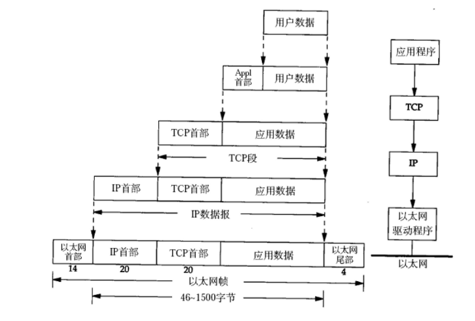
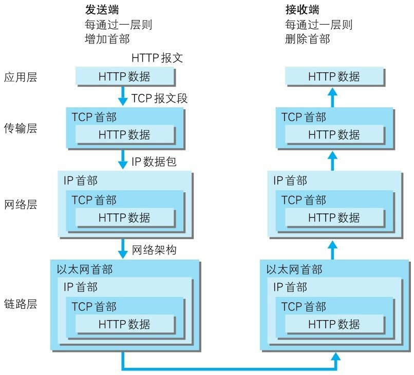
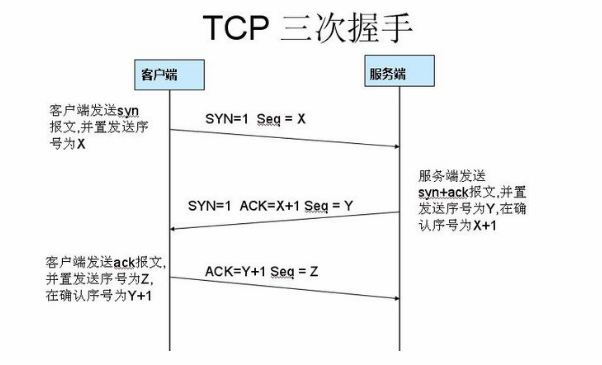
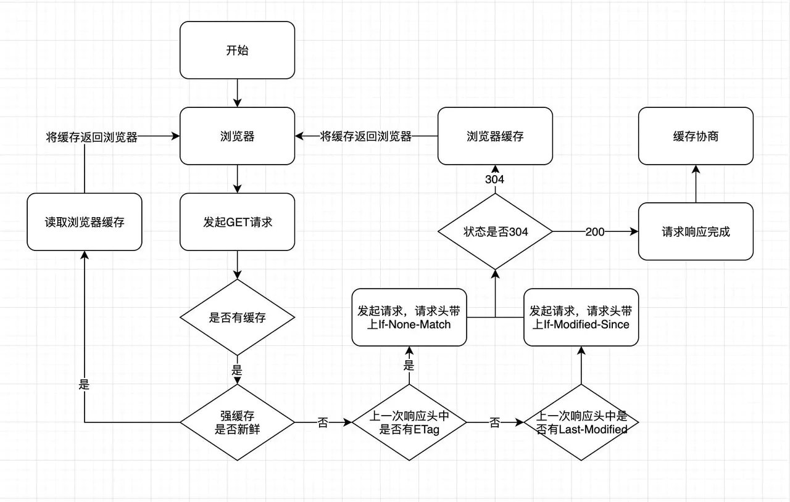
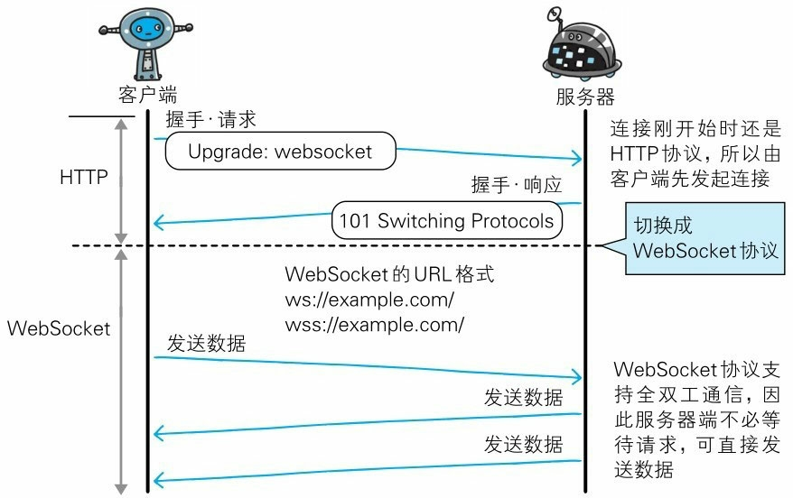
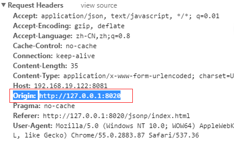
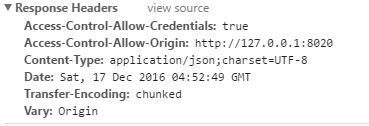

# 网络模型

通常，网络通信的基础设施会按照功能和实现分成不同的层次，分层原因如下：

- 易于实现和标准化各层独立，就可以把大问题分割成多个小问题，利于实现；

- 灵活性好：如果某一层发生变化，只要接口不变，不会影响其他层；

- 分层后，用户只关心用到的应用层，其他层用户可以复用；

- 各层之间相互独立：高层不需要知道底层的功能是采取硬件来实现的，只需要知道通过底层的接口来获得所需要的服务。
  

而我们在查找相关资料会发现网络模型有分七层的，五层的，也有四层的，那么网络模型到底是七层、五层还是四层呢？

## OSI七层模型

 七层模型，亦称`OSI（Open System Interconnection）`。参考模型是国际标准化组织`（ISO）`制定的一个用于计算机或通信系统间互联的标准体系，一般称为`OSI参考模型`或`七层模型`，它是一个开放式系统互联参考模型，是理论上的规范。

也就是说理论规范上是将网络模型分为了七层，分别是：

| 序号 | 层次       | 详细说明                                                     | 实现                                                         |
| ---- | ---------- | ------------------------------------------------------------ | ------------------------------------------------------------ |
| 1.   | 应用层     | 应用层为应用程序提供服务。比如`FTP(文件传输协议)`、`DNS(域名系统)`还有`HTTP`。 | TELNET、FTP、POP3、SMTP、HTTP、DHCP、DNS等                   |
| 2.   | 表示层     | 表示层为在应用过程之间传送的信息提供表示方法的服务，它的主要作用之一是为异种机通信提供一种公共语言，以便能进行互操作。这种类型的服务之所以需要，是因为不同的计算机体系结构使用的数据表示法不同。简单解释就是：通用的数据格式、数据转换和加密。 | ASCII、JPEG、GIF、MPEG等                                     |
| 3.   | 会话层     | 会话层是建立在传输层之上，利用传输层提供的服务，使应用建立和维持会话，并能使会话获得同步。会话层建立、维护和管理会话。 | RPC、SCP、Socks等                                            |
| 4.   | 传输层     | 传输层对上层应用层提供处于网络连接中的两台计算机之间的数据传输。在传输层有两个性质不同的协议：`TCP(传输控制协议)`、`UDP(用户数据报协议)`。 | TCP、UDP                                                     |
| 5.   | 网络层     | 网络层用来处理在网络上流动的数据包。数据包是网络传输的最小单位。该层规定了通过怎样的路径到达对方计算机，并把数据包传送给对方。与对方计算机之间通过多台计算机或网络设备进行传输时，网络层所起的作用就是在众多的选项内选择一条传输路线、IP地址选择和路由选择。 | IP、ICMP                                                     |
| 6.   | 数据链路层 | 将网络层传来的数据包传递到物理层，数据分帧、处理流控制、物理地址寻址等。 | MAC、网桥、交换机协议                                        |
| 7.   | 物理层     | 主要定义物理设备标准，如网线的接口类型、光纤的接口类型、各种传输介质的传输速率等。物理层确保原始的数据可在各种物理媒体上传输。 | RS-232、ISDN、FDDI、IEEE802.3、IEEE802.4、IEEE802.5、网卡光纤、线、集线器、串口、并口协议等 |

## TCP/IP四层网络模型

`OSI`引进了服务、接口、协议、分层的概念，但它只是一种理论上的模型，并没有被完全实现，`TCP/IP`借鉴`OSI`建立了`TCP/IP`模型，`TCP/IP模型`更符合实际，已经被广泛应用，成为了当今互联网的基石。

`TCP/IP`分为四层，虽然`TCP/IP`和`OSI`不能精确地匹配，但是可以简单地认为将会话层、表示层合并进入应用层，将物理层并入数据链路层。所以四层分别为：应用层、传输层、网络层、数据链路层。

## TCP/IP五层网络模型

 所谓的五层模型其实是为了方便学习计算机网络原理而采用的。它是`OSI`和`TCP/IP`的综合，和四层模型的区别就在于数据链路层和物理层分离。

实际上，它的本质是四层模型。

# HTTP协议发展历程

## HTTP是什么？

 `超文本传输协议（HyperText Transfer Protocol，缩写：HTTP）`是一种应用层通信协议。简单来说，它是一种允许`超文本：通常是超文本标记语言（HTML）`从一端传送到另一端的一种规则。

## HTTP版本

### http/0.9

发布于1991年，该版本极其简单：

- 只有一个命令`GET`。
- 没有`HEADER`等描述数据的信息。
- 只能返回`HTML`格式的字符串，不能回应别的格式。
- 服务器发送完毕，就关闭`TCP`连接。

### http/1.0

发布于1996年5月：

- 可以发送任何格式，比如文字、图像、视频、二进制文件等。
- 除了`GET`，还增加了`POST`和`HEAD`命令。
- 除了数据部分，每次通信必须包括`头信息（HEADER）`，用来描述一些元数据。
- 新增了 `状态码（status code）`、`多字符集支持`、`多部分发送（multi-part type）`、`权限（authorization）`、`缓存（cache）`、`内容编码（content encoding）`等 。

`HTTP/1.0 `的主要缺点是，每个`TCP`连接只能发送一个请求。发送数据完毕，连接就关闭，如果还要请求其他资源，就必须再新建一个连接。

`TCP`连接的新建成本很高，因为需要客户端和服务器三次握手，并且开始时发送速率较慢。所以，`HTTP 1.0`的性能比较差。随着网页加载的外部资源越来越多，这个问题就愈发突出了。

为了解决这个问题，有些浏览器在请求时，用了一个非标准的`Connection`字段：`Connection: keep-alive`，这个字段要求服务器不要关闭TCP连接，以便其他请求复用。服务器同样回应这个字段：`Connection: keep-alive`，一个可以复用的`TCP`连接就建立了，直到客户端或服务器主动关闭连接。但是，这不是标准字段，不同实现的行为可能不一致，因此不是根本的解决办法。

### HTTP/1.1

1997年1月发布，进一步完善了`HTTP`协议，直到现在，这个依然是最流行的`HTTP`版本：

- 引入了持久连接，即`TCP`连接默认不关闭，可以被多个请求复用，不用声明`Connection: keep-alive`。客户端和服务器发现对方一段时间没有活动，就可以主动关闭连接。不过，规范的做法是，客户端在最后一个请求时，发送`Connection: close`，明确要求服务器关闭`TCP`连接。
- 引入了管道机制，即在同一个`TCP`连接里面，客户端可以同时发送多个请求。这样就进一步改进了`HTTP`协议的效率。举例来说，客户端需要请求两个资源。以前的做法是，在同一个`TCP`连接里面，先发送`A`请求，然后等待服务器做出回应，收到后再发出`B`请求。管道机制则是允许浏览器同时发出`A`请求和`B`请求，但是服务器还是按照顺序，先回应`A`请求，完成后再回应`B`请求。
- 新增`Content-Length`字段，一个`TCP`连接现在可以传送多个回应，势必就要有一种机制，区分数据包是属于哪一个回应的。这就是`Content-length`字段的作用，声明本次回应的数据长度：`Content-Length: 3495`，告诉浏览器，本次回应的长度是`3495`个字节，后面的字节就属于下一个回应了。
- 分块传输编码。使用`Content-Length`字段的前提条件是，服务器发送回应之前，必须知道回应的数据长度。对于一些很耗时的动态操作来说，这意味着，服务器要等到所有操作完成，才能发送数据，显然这样的效率不高。更好的处理方法是，产生一块数据，就发送一块，采用`流模式（stream）`取代`缓存模式（buffer）`。因此，`1.1`规定可以不使用`Content-Length`字段，而使用[分块传输编码（chunked transfer encoding）](https://zh.wikipedia.org/wiki/分块传输编码)。只要请求或回应的头信息有`Transfer-Encoding`字段，就表明回应将由数量未定的数据块组成：`Transfer-Encoding: chunked`。每个非空的数据块之前，会有一个`16进制`的数值，表示这个块的长度。最后是一个大小为`0`的块，就表示本次回应的数据发送完了。
- 新增了一些方法： `PUT`、`PATCH`、`HEAD`、 `OPTIONS`、`DELETE`。
- 客户端请求头信息新增`Host`字段，用来指定服务器域名：`Host:example.com`，  有了`Host`字段，就可以将请求发往同一台服务器上，服务器再根据域名的不同分配到该服务器启动的不同服务上。 

`http/1.1`的缺点在于，虽然允许复用`TCP`连接，但是同一个`TCP`连接里面，所有的数据通信是按次序进行的。服务器只有处理完一个回应，才会进行下一个回应。要是前面的回应特别慢，后面就会有许多请求排队等着。这称为[队头堵塞（Head-of-line blocking）](https://zh.wikipedia.org/wiki/队头阻塞)。

为了避免这个问题，只有两种方法：一是减少请求数，二是同时多开持久连接。这导致了很多的网页优化技巧，比如合并脚本和样式表、将图片嵌入`CSS`、域名分片等等。如果`HTTP`协议设计得更好一些，这些额外的工作是可以避免的。

### HTTP/2

在提到`HTTP/2`之前，不得不提到`SPDY`协议，2009年，谷歌公开了自行研发的 `SPDY `协议，主要解决 `HTTP/1.1 `效率不高的问题。

这个协议在`Chrome`浏览器上证明可行以后， `互联网工程任务组（IETF）`对`SPDY`协议进行了标准化，于2015年5推出了类似于`SPDY`协议的 `HTTP/2`协议标准。

-  二进制协议。`HTTP/1.1` 的头信息是`文本（ASCII编码）`，数据体可以是文本，也可以是二进制。`HTTP/2` 则是一个彻底的二进制协议，头信息和数据体都是二进制，并且统称为`帧（frame）`：头信息帧和数据帧。二进制协议的一个好处是，可以定义额外的帧。`HTTP/2` 定义了近十种帧，为将来的高级应用打好了基础。如果使用文本实现这种功能，解析数据将会变得非常麻烦，二进制解析则方便得多。
- 多工复用。`HTTP/2` 复用`TCP`连接，在一个连接里，客户端和浏览器都可以同时发送多个请求或回应，而且不用按照顺序一一对应，这样就避免了`队头堵塞`。举例来说，在一个`TCP`连接里面，服务器同时收到了`A`请求和`B`请求，于是先回应`A`请求，结果发现处理过程非常耗时，于是就发送`A`请求已经处理好的部分， 接着回应`B`请求，完成后，再发送`A`请求剩下的部分。这样双向的、实时的通信，就叫做`多工（Multiplexing）`。
- 数据流。因为` HTTP/2` 的数据包是不按顺序发送的，同一个连接里面连续的数据包，可能属于不同的回应。因此，必须要对数据包做标记，指出它属于哪个回应。`HTTP/2` 将每个请求或回应的所有数据包，称为一个`数据流（stream）`。每个数据流都有一个独一无二的编号。数据包发送的时候，都必须标记`数据流ID`，用来区分它属于哪个数据流。另外还规定，客户端发出的数据流，`ID`一律为奇数，服务器发出的，`ID`为偶数。数据流发送到一半的时候，客户端和服务器都可以发送`信号（RST_STREAM帧）`，取消这个数据流。`1.1`取消数据流的唯一方法，就是关闭`TCP`连接。这就是说，`HTTP/2` 可以取消某一次请求，同时保证`TCP`连接还打开着，可以被其他请求使用。客户端还可以指定数据流的优先级。优先级越高，服务器就会越早回应。
- 头信息压缩。`HTTP` 协议不带有状态，每次请求都必须附上所有信息。所以，请求的很多字段都是重复的，比如`Cookie`和`User Agent`，一模一样的内容，每次请求都必须附带，这会浪费很多带宽，也影响速度。`HTTP/2` 对这一点做了优化，引入了`头信息压缩机制（header compression）`。一方面，头信息使用`gzip`或`compress`压缩后再发送；另一方面，客户端和服务器同时维护一张头信息表，所有字段都会存入这个表，生成一个索引号，以后就不发送同样字段了，只发送索引号，这样就提高速度了。
- 服务器推送。`HTTP/2` 允许服务器未经请求，主动向客户端发送资源，这叫做`服务器推送（server push）`。

### HTTP/3

在提到`HTTP/3`之前，同样不得不提到`QUIC`协议，2013年，谷歌开发了`QUIC`协议。 `QUIC`使用[UDP](https://zh.wikipedia.org/wiki/用户数据报协议)协议，它在两个端点间创建连线，且支持[多路复用](https://zh.wikipedia.org/wiki/多路复用)连线。在设计之初，`QUIC`希望能够提供基于[TLS](https://zh.wikipedia.org/wiki/TLS)/[DTLS](https://zh.wikipedia.org/wiki/DTLS)的网络安全保护，减少数据传输及创建连线时的延迟时间，双向控制带宽，以避免网络拥塞。`Google`希望使用这个协议来取代[HTTPS](https://zh.wikipedia.org/wiki/HTTPS)/[HTTP](https://zh.wikipedia.org/wiki/HTTP)协议，使网页传输速度加快，计划将`QUIC`提交至[互联网工程任务小组](https://zh.wikipedia.org/wiki/互联网工程任务组)（[IETF](https://zh.wikipedia.org/wiki/IETF)），让它成为下一代的正式网络规范。2015年6月，`QUIC`的网络草案被正式提交至[互联网工程任务组](https://zh.wikipedia.org/wiki/互联网工程任务组)。2018 年 10 月，互联网工程任务组`HTTP`及 `QUIC` 工作小组正式将`基于 QUIC协议的 HTTP（HTTP over QUIC）`重命名为[HTTP/3](https://zh.wikipedia.org/wiki/HTTP/3)以为确立下一代规范做准备。 

`HTTP/3`的特点：

- 减少了 `TCP` 三次握手及 `TLS` 握手时间。使用`TCP`协议配合`HTTPS`，`TLS` 完全握手需要至少 2 个` RTT` 才能建立，简化握手需要 1 个` RTT `的握手延迟，而`QUIC`在`TLS`握手时间上，由于建立在 `UDP` 的基础上，同时又实现了 `0RTT` 的安全握手，所以在大部分情况下，只需要 0 个 `RTT` 就能实现数据发送。

- 改进的拥塞控制。`QUIC` 协议当前默认使用了 `TCP `协议的 `Cubic `拥塞控制算法，同时也支持 `CubicBytes`,` Reno`,` RenoBytes`,` BBR`,` PCC `等拥塞控制算法。

- 避免队头阻塞的多路复用。队头阻塞主要是 `TCP` 协议的可靠性机制引入的。上面说了`TCP`为了实现可靠性，使用了很多机制来保障数据的传输，例如使用序列号来标识数据的顺序，数据必须按照顺序处理，如果前面的数据丢失，后面的数据就算到达了也不会通知应用层来处理。而`QUIC`使用`UDP`，没有三次握手和连接，只需要用户端和服务端的应用程序支持 `QUIC` 协议，完全避开了操作系统和中间设备的限制，同时相比此前的`HTTP/2`的多路复用，`QUIC` 一个连接上的多个流之间没有依赖。这样可以更快地并行处理任务。

- 比`TCP`协议更安全。`TCP` 协议的头部没有加密和认证，在传输过程中很容易被篡改，注入和窃听。而 `QUIC` 除了个别报文比如 `PUBLIC_RESET` 和 `CHLO`，所有报文头部都是经过认证的，报文 `Body` 都是经过加密的。

- 能够连接迁移。什么是连接迁移？比如使用手机从无线网切换到移动`5G`，这时客户端的`IP`会改变，需要重新建立和服务端的 `TCP` 连接。而`QUIC`实现了任何一条 `QUIC` 连接不再以 `IP` 及端口进行标识，而是以一个 `64 位`的随机数作为 `ID` 来标识，这样当网络变化，`IP`和端口改变，只要 `ID` 不变，这条连接依然维持着，上层业务逻辑感知不到变化，不会中断，也就不需要重连。且由于这个`ID`是随机的，产生冲突的概率非常小。

- 更科学的流量控制器。`TCP` 为了保证可靠性，窗口左边沿向右滑动时的长度取决于已经确认的字节数。如果中间出现丢包，就算接收到了更大序号的 `Segment`，窗口也无法超过这个序列号。而`QUIC` 基于流和连接级别的流量控制，类似`HTTP/2`，通过`window_update帧`告诉对端自己可以接收的字节数，这样发送方就不会发送超过这个数量的数据。通过`BlockFrame`告诉对端由于流量控制被阻塞了，无法发送数据。就算此前有些数据包没有接收到，它的滑动只取决于接收到的最大偏移字节数。

可以说，`QUIC`基于`UDP`，又取了`TCP`的精华，力求提供`UDP`的速度和效率，又能提供`TCP`的可靠性。但是`HTTP/3`想要成为互联网的标准还有很长的路要走。

# 数据的封装和传输

## 数据包的封装过程

传输层及其以下的机制由内核提供，应用层由用户进程提供，应用程序对通讯数据的含义进行解释，而传输层及其以下处理通讯的细节，将数据从一台计算机通过一定的路径发送到另一台计算机。应用层数据通过协议栈发到网络上时，每层协议都要加上一个`数据首部（header）`，链路层还会加上尾部信息，称为`封装（Encapsulation）`，如下图所示：



## 数据包的传输过程

- 发送端发送数据时，数据会从上层传输到下层，且每经过一层都会被打上该层的头部信息。
- 接受端接收数据时，数据会从下层传输到上层，每经过一层会将该层的头部信息删除。



# 透过TCP/IP看HTTP

`TCP/IP协议族`是一系列与互联网相关联的协议的集合的总称。而`HTTP协议`正是`TCP/IP协议族`的成员之一。正如前面所说，`TCP/IP`是分层管理的，有经典的`TCP/IP四层网络模型`，`HTTP`位于模型的应用层。

`HTTP`是应用层协议，自己不具备传输功能，必须要选择传输层的传输通信协议来进行通信，在传输层有两种不同的协议：一种是`TCP（传输控制协议）`，一种面向连接的、可靠的、基于字节流的传输层通信协议；另一种是`UDP（用户数据报协议）`，一种无连接的、不可靠的、无阻塞控制的、快速且低开销的传输层通信协议。为了双方的可靠性，大多数情况下，`HTTP`通过`TCP`来进行数据传输。

## TCP

### 三次握手

使用`TCP`协议进行通信的双方必须先建立连接，然后才能开始传输数据。为了确保连接双方的可靠性，在双方建立连接时，`TCP`采用了三次握手策略。

三次握手的流程为：

- 第一次握手：客户端发送带有`SYN`标志的数据包（`SYN`是`同步序列编号`的意思，它是`TCP/IP`建立连接时的握手信号），同时带有一个随机的序列号`seq（sequence number）`，进入`SYN_SEND`状态，等待服务端确认。
- 第二次握手：服务端接收到客户端的`SYN`报文段后，需要发送`ACK（acknowledge number，即 确认号码）`信息对这个`SYN`报文段进行确认（值为客户端发送的`seq + 1`），同时附带一个`SYN`（服务端也要请求）以及一个随机序列号`seq`，发送回客户端，进入`SYN_RECV`状态。
- 第三次握手：客户端接收到服务端的`SYN`以及`ACK`报文段后，生成`ACK（客户端的seq + 1）`，并随机生成一个`seq`，一并发送回服务端。此时客户端和服务端都进入`ESTABLISHED`状态，完成`TCP`三次握手。



> 为什么要经过三次握手呢？两次难道不行吗？四次呢？

其实原因很简单，举个例子，两个人写信：

- A -> B：你好，B！
- A <- B： 收到，你好，A！

这相当于两次握手：

- 第一次握手，`A`给`B`打招呼，此时`A`知道自己的发送是正常的，但是不知道`B`能否接收。
- `B`收到`A`的信息后，知道`A`给自己打招呼，于是给予回应，便有了第二次握手。

是不是已经发现问题所在了？问题就在于`B`不知道`A`是否能接收到自己的回应。所以需要增加第三次握手：

- A -> B： 收到，B！

`B`接收到后，双方都能知道对方已经能接收到自己的回应，真正地建立连接。

可以知道，三次握手已经可以完成连接了，那么四次自然也是可以的，只不过四次握手需要花费更多的时间和资源，三次是更好的方案。

### 四次挥手

建立一个`TCP`连接需要三次握手，而终止一个连接则需要四次挥手，这是由于`TCP`的**半关闭**造成的，所谓半关闭，就是`TCP`提供了连接的一端在结束它的发送之后还能接收来自另一端数据的能力。

`TCP`连接的双方都可以主动发起挥手动作。

- 第一次挥手：假设客户端主动发起挥手，客户端发送一个`FIN（finish）`报文，同时携带一个随机序号`seq`，停止发送数据，进入`FIN_WAIT1`状态，等待服务端确认。
- 第二次挥手：服务端收到客户端的`FIN`报文，会发送`ACK（值为客户端seq + 1）`报文，表名已经收到客户端的报文，并进入`CLOSE_WAIT`状态。客户端接收到此报文后会关闭自己的发送通道，并进入`FIN_WAIT2`状态，此时`TCP`处于半关闭状态。
- 第三次挥手： 如果服务端也要断开连接，则和客户端第一次挥手一样，此时服务端处于`LAST_ACK`状态，即服务端没有要向客户端发送的数据，等待客户端确认。
- 第四次挥手：客户端收到服务端的`FIN`报文，会生成一个`ACK（服务端的seq + 1）`，同时会随机生成`seq`，返回给服务端，此时客户端进入`TIME_WAIT`状态，但会在经过`2MSL`后进入`CLOSED`状态，而服务端收到客户端的`ACK`报文后，会立即进入`CLOSED`状态。

> 挥手为什么需要四次？

因为`TCP`的连接是全双工的，所以断开连接需要将两个通道分别断开，必须要等待两边都没有数据传输时才能断开整个链路，因此四次是两方分别断开连接所必要的，每一边断开都需要经过一次请求和一次回应。

> 为啥一方要等待2MSL之后才关闭？

`MSL（Maximum Segment Lifetime）`,即`报文最大生存时间`,它是任何报文在网络上存活的最长时间，超过这个时间的报文将被丢弃。`2MSL`即两倍的`MSL`。

之所以要等待`2MSL`，是因为无法保证第四次挥手的报文一定被对方收到，如果这个报文丢失，那么对方会在超时后重复发送`FIN`报文。所以不能立即关闭，而是要确保对方在超时时间过后未发送报文，确定对方已经收到`ACK`报文关闭了通道。至于为什么是`2MSL`而不是`MSL`或者其他的，因为最坏的情况下需要等待的时间为：`去向ACK报文的最大存活时间（1MSL）+ 来向FIN报文的最大存活时间（1MSL）`。

# DNS域名解析

通常我们访问一个网站，会使用域名进行访问，因为相比`IP`地址的一堆数字，使用域名更符合习惯也更容易记住。但是互联网是基于`TCP/IP`协议之上的，要访问对方必须要知道对方的`IP`地址，在使用域名访问时实际上会被转换成`IP`地址，而`DNS`就是实现域名解析成`IP`地址的服务。

> 访问一个网站的`DNS`解析流程如下: 

1. 以浏览器访问` www.mexion.xyz` 域名为例,首先,它会去检查当前浏览器缓存是否有对应`IP`,如果有就直接响应,如果没有就继续往下找。
2. 检查操作系统的`host`文件,如果`host`中有,就直接返回该域名所对应的`IP`地址，如果未命中,会向本地`DNS`服务器（比如`8.8.8.8`）请求查找。
3. 本地`DNS`服务器如果在自己的解析库中找到对应的`IP`地址则返回，没找到则自动向根服务器发送请求，所谓根服务器，就是网址最后的`.`，我们平时看到的域名比如`mexion.xyz`，其实完整写法为`mexion.xyz.`，最后还有一个点，它是所有域名的根域名。
4. 根服务器接收到请求的是`xyz`的后缀(`.xyz`),就返回`xyz`所在的`DNS`服务器地址。
5. 当请求到达`xyz`的`DNS`服务器时,`xyz`服务器看到域名在`mexion`这个域下,就会返回`mexion`所在的`DNS`服务器。
6. `mexion`这个域的`DNS`服务器一看是要访问`www`就直接找到了`www`对应的`A`记录的`IP`地址并返回,上面逐步查询的过程,即 `迭代查询`。

# URI和URL

在`HTTP`中，有三个不同的概念`URI`、`URL`、`URN`，如下图：


从图上其实就可以看到，`URL`和`URN`都是`URI`的子集。`URI`的定义为：一个紧凑的字符串用来标示抽象或物理资源。`URI`可以分为`URL`，`URN`或同时具备`locators`和`names`特性的一个东西，`URN`就像一个人的名字，确定了他的身份，`URL`就像一个人的地址，提供了找到他的方式。要判断是不是`URL`，就要看它是不是提供了**访问机制**，比如`http://`以及`ftp://`等都提供了具体的访问机制。

# 浏览器输入URL回车后发生了什么？

| 序号 | 过程                    | 详细说明                                                     |
| ---- | ----------------------- | ------------------------------------------------------------ |
| 1.   | `Redirect`（跳转）      | 首先会进行`Redirect`，因为浏览器可能已经记录了这个地址已经永久跳转成一个新的地址，所以浏览器在一开始就会判断需不需要`Redirect`，需要跳转到哪里。 |
| 2.   | `APP cache`（应用缓存） | 第二步是查看缓存，因为请求的资源可能已经缓存过了，需要查看`App cache`中是否已经缓存，如果没有缓存，再去进行请求。 |
| 3.   | `DNS`（`DNS`解析）      | 我们输入的一般是域名，通过域名是无法与服务器进行连接的，需要通过`DNS`查找到对应的`IP`地址之后才能进行连接 。 |
| 4.   | `TCP`（创建`TCP`连接）  | 创建`TCP`连接需要经过三次握手，如果这个连接是`HTTPS`的，需要创建一个`HTTTPS`的连接。 |
| 5.   | `Request`（发送请求）   | 连接成功后开始发送`HTTP`请求。                               |
| 6.   | `Response`（接收响应）  | 服务器接收到请求并返回请求需要的内容。                       |

# HTTP缓存

HTTP`的缓存机制，可以使浏览器可以复用以前获取的资源，减少了请求时间以及网络流量，缓解服务器压力，还可以显著提高网站和应用程序的性能。下面是缓存运作的一个整体流程图：

浏览器的缓存分为两种：`强缓存`和`协商缓存`。

## 强缓存

> `强缓存`，`强`可以理解为`强制`的意思。客户端不需要发送请求到服务端，直接读取浏览器的本地缓存。

缓存的位置分为`硬盘缓存（Disk Cache）`和`内存缓存（Memory Cache）`，由浏览器决定缓存位置，无法进行干涉，读取缓存后的状态码为`200`。

强缓存的使用由`Expires`、`Cache-Control`、`Pragma`三个`Header`属性来控制。

- **Expires**

  `Expires` 的值是一个 `HTTP` 日期（例如：`Expires: Wed, 21 Oct 2015 07:28:00 GMT`），在浏览器发起请求时，会根据系统时间和 `Expires` 的值进行比较，如果系统时间超过了 `Expires` 的值，缓存失效。由于和系统时间进行比较，所以当系统时间和服务器时间不一致的时候，会有缓存有效期不准的问题。`Expires` 的优先级在三个 `Header` 属性中是最低的。

- **Cache-Control**

  `Cache-Control` 是 `HTTP/1.1` 中新增的属性，在请求头和响应头中都可以使用，常用的属性值如有：

  - `max-age`：单位是秒，缓存时间计算的方式是距离发起的时间的秒数，超过间隔的秒数缓存失效
  - `no-cache`：不使用强缓存，可以使用协商缓存，必须要与服务器验证缓存是否新鲜
  - `no-store`：禁止使用缓存（包括协商缓存），每次都向服务器请求最新的资源
  - `private`：专用于个人的缓存，中间代理、`CDN` 等不能缓存此响应
  - `public`：响应可以被中间代理、`CDN` 等缓存
  - `must-revalidate`：在缓存过期前可以使用，过期后必须向服务器验证

- **Pragma**

  `Pragma` 只有一个属性值，就是 `no-cache` ，效果和 `Cache-Control` 中的 `no-cache` 一致，不使用强缓存，需要与服务器验证缓存是否新鲜。

  这个属性是一个历史遗留属性， 它用来向后兼容只支持 `HTTP/1.0` 协议的缓存服务器，那时候 `HTTP/1.1` 协议中的 `Cache-Control` 还没有出来。  建议只在需要兼容 `HTTP/1.0` 的场合下应用 `Pragma` 首部。 

## 协商缓存

> `协商缓存`由服务端来确定缓存资源是否可用，客户端需要与服务端通过某种标识来协商，从而让服务器判断请求资源是否可以使用缓存。（注意：只有不走强缓存才会走协商缓存，也就是说强缓存头部属性的优先级高）。

当浏览器的强缓存失效的时候或者请求头中设置了不走强缓存，并且在请求头中设置了`If-Modified-Since` 或者 `If-None-Match` 的时候，会将这两个属性值到服务端去验证是否命中协商缓存，如果命中了协商缓存，会返回 `304` 状态，加载浏览器缓存，并且响应头会设置 `Last-Modified` 或者 `ETag` 属性。

- **Last-Modified/If-Modified-Since**
  服务器通过响应头Last-Modified告知浏览器，资源最后被修改的时间：
  如`last-modified: Wed, 17 Apr 2019 22:40:00 GMT（Response Headers）`， 当再次请求该资源时，浏览器需要再次向服务器确认，资源是否过期，其中的凭证就是请求头`If-Modified-Since`字段，值为上次请求中响应头`Last-Modified`字段的值：`If-Modified-Since: Thu, 18 Apr 2019 17:05:33 +0800（Request Headers）`， 服务器会接收`If-Modified-Since`字段的值与被请求资源的最后修改时间作比较，如果`If-Modified-Since`的值大于等于被请求资源的最后修改时间，则说明浏览器缓存的资源仍然有效，服务器会返回`304`状态码，告知浏览器直接取缓存即可。其中服务器返回的只有`HTTP`头部，并不包含主体（不然就没有缓存的意义了）。 否则，就跟正常的请求一样，服务器返回`200`状态码，并附带最新的资源。

- **ETag/If-None-Match**

  `ETag/If-None-Match` 的值是一串 `hash` 码，代表的是一个资源的标识符，当服务端的文件变化的时候，它的 `hash`码会随之改变，通过请求头中的 `If-None-Match` 和当前文件的 `hash` 值进行比较，如果相等则表示命中协商缓存。`ETag` 又有强弱校验之分，如果 `hash` 码是以 `"W/"` 开头的一串字符串，说明此时协商缓存的校验是弱校验的，只有服务器上的文件差异（根据 `ETag` 计算方式来决定）达到能够触发 `hash` 值后缀变化的时候，才会真正地请求资源，否则返回 `304` 并加载浏览器缓存。`ETag/If-None-Match`的优先级比`Last-Modified/If-Modified-Since`高。

`Last-Modified/If-Modified-Since`是对应的，`Last-Modified`是由服务端返回的，再次请求时客户端会自动带上`If-Modified-Since`，值为上次服务端返回的`Last-Modified`。

`ETag/If-None-Match`是对应的，`ETag`是由服务端返回的，再次请求时客户端会自动带上`If-None-Match`，值为上次服务端返回的`ETag`。

# 内容协商机制

> `内容协商`指客户端和服务端就响应的资源内容进行交涉，然后提供给客户端最为适合的资源。内容协商会以响应资源的语言，字符集，编码方式等作为判断基准。

常见的内容协商方式：

- **客户端驱动**

  客户端发起请求，服务器发送可选项列表，客户端做出选择后再发送二次请求。（缺点很明显，不明立刻看到页面内容，需要用户选择，而且需要发送两次请求）。

- **服务器驱动**

  客户端通过头部信息来请求不同版本的内容，服务器检查客户端头部信息决定提供哪个版本的页面（常用）。

## 媒体类型

在讲内容协商之前需要先了解`媒体类型(MIME_type)`，`MIME_type（媒体类型）` 是一种标准，用来表示文档、文件或字节流的性质和格式。它在[IETF RFC 6838](https://tools.ietf.org/html/rfc6838)中进行了定义和标准化。 

 互联网号码分配机构（[IANA](https://www.iana.org/)）是负责跟踪所有官方MIME类型的官方机构，您可以在[媒体类型](https://www.iana.org/assignments/media-types/media-types.xhtml)页面中找到最新的完整列表。 

### 通用结构

```
type/subtype
```

`MIME`的组成结构非常简单；由类型与子类型两个字符串中间用`'/'`分隔而组成。不允许空格存在。`type` 表示可以被分多个子类的独立类别。`subtype` 表示细分后的每个类型。

`MIME`类型对大小写不敏感，但是传统写法都是小写。

### 独立类型

*独立*类型表明了对文件的分类，可以是如下之一：

| 类型          | 描述                                                         | 典型示例                                                     |
| :------------ | :----------------------------------------------------------- | :----------------------------------------------------------- |
| `text`        | 表明文件是普通文本，理论上是人类可读                         | `text/plain`, `text/html`, `text/css, text/javascript`       |
| `image`       | 表明是某种图像。不包括视频，但是动态图（比如动态`gif`）也使用`image`类型 | `image/gif`, `image/png`, `image/jpeg`, `image/bmp`, `image/webp`, `image/x-icon`, `image/vnd.microsoft.icon` |
| `audio`       | 表明是某种音频文件                                           | `audio/midi`, `audio/mpeg, audio/webm, audio/ogg, audio/wav` |
| `video`       | 表明是某种视频文件                                           | `video/webm`, `video/ogg`                                    |
| `application` | 表明是某种二进制数据                                         | `application/octet-stream`, `application/pkcs12`, `application/vnd.mspowerpoint`, `application/xhtml+xml`, `application/xml`, `application/pdf` |

对于`text`文件类型若没有特定的`subtype`，就使用 `text/plain`。类似的，二进制文件没有特定或已知的 `subtype`，即使用 `application/octet-stream`。

### Multipart 类型

```
multipart/form-data
multipart/byteranges
```

`Multipart` 类型表示细分领域的文件类型的种类，经常对应不同的 `MIME` 类型。这是*复合*文件的一种表现方式。`multipart/form-data` 可用于联系 [HTML Forms](https://developer.mozilla.org/en-US/docs/Web/Guide/HTML/Forms) 和 [`POST`](https://developer.mozilla.org/zh-CN/docs/Web/HTTP/Methods/POST) 方法，此外 `multipart/byteranges`使用状态码[`206`](https://developer.mozilla.org/zh-CN/docs/Web/HTTP/Status/206) `Partial Content`来发送整个文件的子集，而HTTP对不能处理的复合文件使用特殊的方式：将信息直接传送给浏览器（这时可能会建立一个“另存为”窗口，但是却不知道如何去显示内联文件。）

### 常见的MIME类型

| 扩展名         | 文档类型                                                     | MIME 类型                                                    |
| :------------- | :----------------------------------------------------------- | :----------------------------------------------------------- |
| `.aac`         | AAC audio                                                    | `audio/aac`                                                  |
| `.abw`         | [AbiWord](https://en.wikipedia.org/wiki/AbiWord) document    | `application/x-abiword`                                      |
| `.arc`         | Archive document (multiple files embedded)                   | `application/x-freearc`                                      |
| `.avi`         | AVI: Audio Video Interleave                                  | `video/x-msvideo`                                            |
| `.azw`         | Amazon Kindle eBook format                                   | `application/vnd.amazon.ebook`                               |
| `.bin`         | Any kind of binary data                                      | `application/octet-stream`                                   |
| `.bmp`         | Windows OS/2 Bitmap Graphics                                 | `image/bmp`                                                  |
| `.bz`          | BZip archive                                                 | `application/x-bzip`                                         |
| `.bz2`         | BZip2 archive                                                | `application/x-bzip2`                                        |
| `.csh`         | C-Shell script                                               | `application/x-csh`                                          |
| `.css`         | Cascading Style Sheets (CSS)                                 | `text/css`                                                   |
| `.csv`         | Comma-separated values (CSV)                                 | `text/csv`                                                   |
| `.doc`         | Microsoft Word                                               | `application/msword`                                         |
| `.docx`        | Microsoft Word (OpenXML)                                     | `application/vnd.openxmlformats-officedocument.wordprocessingml.document` |
| `.eot`         | MS Embedded OpenType fonts                                   | `application/vnd.ms-fontobject`                              |
| `.epub`        | Electronic publication (EPUB)                                | `application/epub+zip`                                       |
| `.gif`         | Graphics Interchange Format (GIF)                            | `image/gif`                                                  |
| `.htm.html`    | HyperText Markup Language (HTML)                             | `text/html`                                                  |
| `.ico`         | Icon format                                                  | `image/vnd.microsoft.icon`                                   |
| `.ics`         | iCalendar format                                             | `text/calendar`                                              |
| `.jar`         | Java Archive (JAR)                                           | `application/java-archive`                                   |
| `.jpeg` `.jpg` | JPEG images                                                  | `image/jpeg`                                                 |
| `.js`          | JavaScript                                                   | `application/javascript`                                     |
| `.json`        | JSON format                                                  | `application/json`                                           |
| `.jsonld`      | JSON-LD format                                               | `application/ld+json`                                        |
| `.mid` `.midi` | Musical Instrument Digital Interface (MIDI)                  | `audio/midi` `audio/x-midi`                                  |
| `.mjs`         | JavaScript module                                            | `text/javascript`                                            |
| `.mp3`         | MP3 audio                                                    | `audio/mpeg`                                                 |
| `.mpeg`        | MPEG Video                                                   | `video/mpeg`                                                 |
| `.mpkg`        | Apple Installer Package                                      | `application/vnd.apple.installer+xml`                        |
| `.odp`         | OpenDocument presentation document                           | `application/vnd.oasis.opendocument.presentation`            |
| `.ods`         | OpenDocument spreadsheet document                            | `application/vnd.oasis.opendocument.spreadsheet`             |
| `.odt`         | OpenDocument text document                                   | `application/vnd.oasis.opendocument.text`                    |
| `.oga`         | OGG audio                                                    | `audio/ogg`                                                  |
| `.ogv`         | OGG video                                                    | `video/ogg`                                                  |
| `.ogx`         | OGG                                                          | `application/ogg`                                            |
| `.otf`         | OpenType font                                                | `font/otf`                                                   |
| `.png`         | Portable Network Graphics                                    | `image/png`                                                  |
| `.pdf`         | Adobe [Portable Document Format](https://acrobat.adobe.com/us/en/why-adobe/about-adobe-pdf.html) (PDF) | `application/pdf`                                            |
| `.ppt`         | Microsoft PowerPoint                                         | `application/vnd.ms-powerpoint`                              |
| `.pptx`        | Microsoft PowerPoint (OpenXML)                               | `application/vnd.openxmlformats-officedocument.presentationml.presentation` |
| `.rar`         | RAR archive                                                  | `application/x-rar-compressed`                               |
| `.rtf`         | Rich Text Format (RTF)                                       | `application/rtf`                                            |
| `.sh`          | Bourne shell script                                          | `application/x-sh`                                           |
| `.svg`         | Scalable Vector Graphics (SVG)                               | `image/svg+xml`                                              |
| `.swf`         | [Small web format](https://en.wikipedia.org/wiki/SWF) (SWF) or Adobe Flash document | `application/x-shockwave-flash`                              |
| `.tar`         | Tape Archive (TAR)                                           | `application/x-tar`                                          |
| `.tif.tiff`    | Tagged Image File Format (TIFF)                              | `image/tiff`                                                 |
| `.ttf`         | TrueType Font                                                | `font/ttf`                                                   |
| `.txt`         | Text, (generally ASCII or ISO 8859-*n*)                      | `text/plain`                                                 |
| `.vsd`         | Microsoft Visio                                              | `application/vnd.visio`                                      |
| `.wav`         | Waveform Audio Format                                        | `audio/wav`                                                  |
| `.weba`        | WEBM audio                                                   | `audio/webm`                                                 |
| `.webm`        | WEBM video                                                   | `video/webm`                                                 |
| `.webp`        | WEBP image                                                   | `image/webp`                                                 |
| `.woff`        | Web Open Font Format (WOFF)                                  | `font/woff`                                                  |
| `.woff2`       | Web Open Font Format (WOFF)                                  | `font/woff2`                                                 |
| `.xhtml`       | XHTML                                                        | `application/xhtml+xml`                                      |
| `.xls`         | Microsoft Excel                                              | `application/vnd.ms-excel`                                   |
| `.xlsx`        | Microsoft Excel (OpenXML)                                    | `application/vnd.openxmlformats-officedocument.spreadsheetml.sheet` |
| `.xml`         | `XML`                                                        | `application/xml` 代码对普通用户来说不可读 ([RFC 3023](https://tools.ietf.org/html/rfc3023#section-3), section 3) `text/xml` 代码对普通用户来说可读 ([RFC 3023](https://tools.ietf.org/html/rfc3023#section-3), section 3) |
| `.xul`         | XUL                                                          | `application/vnd.mozilla.xul+xml`                            |
| `.zip`         | ZIP archive                                                  | `application/zip`                                            |
| `.3gp`         | [3GPP](https://en.wikipedia.org/wiki/3GP_and_3G2) audio/video container | `video/3gpp` `audio/3gpp`（若不含视频）                      |
| `.3g2`         | [3GPP2](https://en.wikipedia.org/wiki/3GP_and_3G2) audio/video container | `video/3gpp2` `audio/3gpp2`（若不含视频）                    |
| `.7z`          | [7-zip](https://en.wikipedia.org/wiki/7-Zip) archive         | `application/x-7z-compressed`                                |

## 请求首部集

服务器驱动的方式需要通过头部信息来决定返回的内容，所以需要一些头部字段来决定请求内容：

- **Accept**

  告知服务器发送何种媒体类型。

  语法为：`Accept: MIME_type/MIME_subtype`，可以使用`*`来代表所有类型，比如：`MIME_type/*`或者`*/*`。当指明多个类型时，可以使用逗号分隔，每个类型后还可以增加权重`q`，用分号分隔，比如：`Accept:text/html,application/xml;q=0.9,*/*;q=0.8`。（权重为`0 ~ 1`的值（最多可保留小数点后三位），值越大，权重越高，未指定`q`默认为`1`）。

- **Accept-Language**

  告知服务器发送何种语言。比如：`Accept-Language: zh-CN,zh;q=0.8,zh-TW;q=0.7,zh-HK;q=0.5,en-US;q=0.3,en;q=0.2`。

- **Accept-Charset**

  告知服务器发送何种字符集。比如：`Accept-Charset: utf-8, iso-8859-1;q=0.5, *;q=0.1`。

- **Accept-Encoding**

  告知服务器采用何种编码（通常是某种压缩算法）。比如：`Accept-Encoding: br;q=1.0, gzip;q=0.8, *;q=0.1`。

# 断点续传和多线程下载

`断线续传`和`多线程下载`通过`Header`的两个参数实现，客户端发送请求时对应的是`Range`，服务端响应时对应的是`Content-Range`。

- **Range**

  用于请求头中，指定第一个字节的位置和最后一个字节的位置。 在一个 `Range` 首部中，可以一次性请求多个部分，服务器会以 `multipart` 文件的形式将其返回。如果服务器返回的是范围响应，需要使用 [`206`](https://developer.mozilla.org/zh-CN/docs/Web/HTTP/Status/206) `Partial Content` 状态码。假如所请求的范围不合法，那么服务器会返回 [`416`](https://developer.mozilla.org/zh-CN/docs/Web/HTTP/Status/416) `Range Not Satisfiable` 状态码，表示客户端错误。服务器允许忽略 `Range` 首部，从而返回整个文件，状态码用 [`200`](https://developer.mozilla.org/zh-CN/docs/Web/HTTP/Status/200) 。 

  格式为：`Range: <unit>=<range-start>-<range-end>`。其中，`<unit>`表示采用的单位，通常是字节`bytes`；`<range-start>`是一个整数，表示范围的起始值；`range-end`是可选的，表示结束值，不指定则延伸到文件的结束。举个例子：`Range: bytes=200-1000, 2000-6576, 19000- `。

- **Content-range**

  用于响应头中，在发出带`Range`的请求后，服务器会在`Content-Range`头部返回当前接受的范围和文件总大小。格式为：`Content-Range: <unit> <range-start>-<range-end>/<size>`，`<size>`为整个文件的大小，位置则用`*`表示。举个例子：`Content-Range: bytes 200-1000/67589 `。

# HTTPS

 `HTTP`协议是一种使用明文数据传输的网络协议。一直以来`HTTP`协议都是最主流的网页协议，但是互联网发展到今天，`HTTP`协议的明文传输会让用户存在一个非常大的安全隐患。试想一下，假如你在一个`HTTP`协议的网站上面购物，你需要在页面上输入你的银行卡号和密码，然后你把数据提交到服务器实现购买。假如这个适合，你的传输数据被第三者给截获了，由于`HTTP`明文数据传输的原因，你的银行卡号和密码，将会被这个截获人所得到。 

 `HTTPS`协议可以理解为`HTTP`协议的升级，就是在`HTTP`的基础上增加了数据加密。在数据进行传输之前，对数据进行加密，然后再发送到服务器。这样，就算数据被第三者所截获，但是由于数据是加密的，所以你的个人信息让然是安全的。这就是`HTTP`和`HTTPS`的最大区别。 

先把`HTTPS`放一边，先思考如何才能使数据的传输安全？

一种方式是双方事先约定一种**对称加密**方式，并且约定一个随机生成的秘钥。后续的通信中，发送方都使用这个秘钥对信息加密，接收方使用这个秘钥进行解密。这样做是不是就绝对安全了呢？并不是。虽然我们在后续的通信中对明文进行了加密，但是第一次约定加密方式和密钥的通信仍然是明文，如果第一次通信就已经被拦截了，那么密钥就会泄露给中间人，中间人仍然可以解密后续所有的通信内容。

为了解决上述问题，改进方式是使用**非对称加密**，即生成一组秘钥对，包含一个公钥和一个私钥。信息可以使用公钥加密，私钥解密；也可以使用私钥加密，公钥解密。比如客户端和服务端建立通信后，服务端生成一组密钥对，并且将公钥`key1`发送给客户端。客户端接收到这个公钥后，生成一个用于**对称加密**的秘钥`key2`，使用刚才接收的`key1`对`key2`进行加密，发送给服务端。服务端存有密钥对中`key1`对应的私钥，所以可以解开并得到使用公钥`key1`加密的`key2`。此后 ，双方就可以使用`key2`进行**对称加密**通信了（可见，非对称加密只用在了获取对称加密的秘钥上，后续的通信实际上使用的是对称加密）。这种方式即使中间人在一开始就截获了公钥`key1`，但是不知道私钥是什么，所以无法解密使用公钥`key1`加密的`key2`。这样是否就能保证数据的安全了呢？还没有。中间人虽然不知道服务端的私钥是什么，但是在截获了公钥`key1`之后，却可以自己另外生成一对密钥对，把自己的公钥`key3`代替`key1`发送给客户端。客户端是不知道公钥是被替换过的，会使用`key3`加密自己生成的`key2`，发送给服务端。这一次通信再次被中间人截获，中间人用自己存有的`key3`对应的私钥解开了客户端的加密，获得了`key2`，然后再用当初服务端发来的`key1`进行加密，发给服务端。这样一来，双方后续的通信虽然使用了`key2`进行对称加密，但是中间人已经得到了`key2`，所以依然可以解密。

那么要怎样才可以保证数据的安全呢？难道要再把公钥进行加密吗？这样只会无限套娃下去，永无止境。

这时候可以引入一个第三方，一个权威的证书颁发机构（`CA`）来解决。服务端首先把自己的公钥`key1`发给`CA`申请证书。 申请时，证书颁发机构会验证你是否拥有这个域名的所有权，比如需要返回什么就返回什么，或者修改`DNS`的某个解值为颁发机构要求的值。证书颁发机构自己也有一对公钥私钥，机构利用自己的私钥来加密`Key1`，并且通过服务端网址等信息生成一个证书签名，证书签名同样经过机构的私钥加密。证书制作完成后，机构把证书发送给服务端。当客户端向服务端发送请求时，服务端不再返回自己的公钥，而是出示证书表名自己是真正的服务器，不是中间人。 客户端收到证书后需要验证证书的真伪（浏览器和操作系统已经维护了所有权威证书机构的名称和公钥）。所以只需要找出对应机构的公钥来解密证书签名，最终拿到`key1`。同之前一样，客户端生成自己的对称加密秘钥`key2`，并且用公钥`key1`进行加密，服务端收到后使用私钥进行解密，拿到`key2`，之后使用`key2`进行对称加密通信。

这便是`HTTPS`的原理，`HTTPS`在`HTTP`的基础上增加了`TLS（SSL）`安全层，刚才打的一系列认证流程就是在`TLS（SSL）`层中完成的。

# WebSocket

`WebSocket`是一种在客户端与服务端之间保持`TCP`长连接的网络协议。通过`WebSocket`，服务器可以直接向客户端发送数据，而无需客户端周期性地请求服务器，以动态更新数据内容。

`WebSocket`与`HTTP`的关系为：

-  `WebSocket`和`HTTP`都是基于`TCP`协议的两个不同的协议
- `WebSocket`依赖于`HTTP`连接 

 `WebSocket`的目的是取代`HTTP`在双向通信场景下的使用，而且它的实现方式有些也是基于`HTTP`的（`WS`的默认端口是`80`和`443`）。现有的网络环境（客户端、服务器、网络中间人、代理等）对`HTTP`都有很好的支持，所以这样做可以充分利用现有的`HTTP`的基础设施，有点向下兼容的意味。 

 简单来讲，`WS`协议有两部分组成：握手和数据传输。 

每个`WebSocket`连接都始于一个`HTTP`请求。具体来说，`WebSocket`协议在第一次握手连接时，通过`HTTP`协议在传送`WebSocket`支持的版本号，协议的字版本号，原始地址，主机地址等等一些列字段给服务器端：

```text
GET /chat HTTP/1.1
Host: server.example.com
Upgrade: websocket
Connection: Upgrade
Sec-WebSocket-Key:dGhlIHNhbXBsZSBub25jZQ==
Origin: http://example.com
Sec-WebSocket-Version: 13
```

注意，关键的地方是，这里面有个`Upgrade`首部，用来把当前的`HTTP`请求升级到`WebSocket`协议，这是`HTTP`协议本身的内容，是为了扩展支持其他的通讯协议。如果服务器支持新的协议，则必须返回`101`：

```text
HTTP/1.1 101 Switching Protocols
Upgrade: websocket
Connection: Upgrade
Sec-WebSocket-Accept:s3pPLMBiTxaQ9kYGzzhZRbK+xOo=
```

至此，`HTTP`请求物尽其用，如果成功触发`onopen`事件，否则触发`onerror`事件，后面的传输则不再依赖`HTTP`协议。



# Cookie和Session

## Cookie

`HTTP`是**无状态**的协议，这也意味着服务器是不知道客户端的用户状态的。`Cookie`的出现让记录用户状态成为了可能。客户端每次发送**同域**请求时都会将这个域名下所有的`Cookie`一起发送给服务端。

`Cookie`是以键值对的形式存储的，比如`a= 123`。

`Cookie`还有一些属性，属性在后面用分号`;`分隔，比如：`b=456;Max-Age=5000;HttpOnly;`。

常用的属性有：

- **Max-Age/Expires**：设置`cookie`的过期时间，如果不设置这两个值那么`cookie`是一个`会话期cookie`，即在浏览器关闭后就会被销毁。`Expires`是一个符合`HTTP-date`规范的时间戳，`cookie`会在这个时间后过期。`Max-Age`是一个秒数，表名`cookie`在经过多长时间后过期，这个属性在`ie6、ie7、ie8`不支持。假如`Expires`和`Max-Age`同时存在，那么`Max-Age`的优先级更高。
- **Secure**： 一个带有`Secure`属性的 `cookie` 只有在请求使用`SSL`和`HTTPS`协议的时候才会被发送到服务器。 

- **HttpOnly**：设置了`HttpOnly`属性的`cookie`不能使用`JavaScript`的`Document.cookie`、`XMLHttpRequest`、`Request APIS`进行访问，以防范`XSS`攻击。
- **Domain**： 指定 `cookie` 可以送达的主机名。假如没有指定，那么默认值为当前文档访问地址中的主机部分（但是**不包含子域名**）。与之前的规范不同的是，域名之前的点号会被忽略。假如指定了域名，那么相当于各个子域名也包含在内了。 


与`Cookie`相关联的两个`HTTP header`为：

- **Cookie**： 请求头携带`cookie`到服务器。
- **Set-Cookie**： 响应头携带，为客户端设置`cookie`。

## Session

`Session`是一种抽象的机制，而不是具体的某种东西。
用户发送登录请求时，服务端会将当前用户的登录信息和登录有效期存在服务端的`session store`中，`session store`也只是一个概念，它可以是任何数据库或者某个地方。这样，所有在登录有效期内的用户都会保存在`seesion store`中。
除此之外，服务端还会生成一个代表当前用户身份的唯一的`Session id`，并通过`Set-Cookie`将它写入到`Cookie`中，这样当用户再次访问就会携带上这个`Session id`，服务端通过这个`id`到`Session store`中匹配，如果匹配到了则表明用户处于登录状态，进行下一步操作，否则返回未登录的状态码提醒用户未登录。

# Redirect

进行路径跳转要把响应码设置为`3xx`，同时还要设置响应头`Location`，`Location` 首部指定的是需要将页面重新定向至的地址。
在指定响应头时，`301`和`302`的区别在于，如果指定`302`则表明是临时进行跳转，在请求时每次依然会访问原路径。而`301`则表明永久跳转，只会在第一次访问原路径，后面浏览器会直接访问跳转路径（使用`301`需要十分谨慎，因为这个操作如果浏览器缓存没有清除，那么之后即使不进行跳转了浏览器也是无法感知的，会直接访问跳转路径）。

# CSP
`CSP` 全称为 `Content Security Policy`，即内容安全策略。主要以白名单的形式配置可信任的内容来源，在网页中，能够使白名单中的内容正常执行（包含` JS`，`CSS`，`Image` 等等），而非白名单的内容无法正常执行，从而减少跨站脚本攻击（`XSS`），当然，也能够减少运营商劫持的内容注入攻击。

## 策略类型

`CSP` 有两种策略类型：
- **Content-Security-Policy**
- **Content-Security-Policy-Report-Only**
这两种策略类型的主要区别也可以从命名上看出，第一种对不安全的资源会进行阻止执行，而第二种只会进行数据上报，不会有实际的阻止。
当定义多个策略的时候，浏览器会优先采用最先定义的。

## 指令集合

`CSP` 的指令是组成内容来源白名单的关键，上面两种策略类型含有以下众多指令，可以通过搭配得到满足网站资源来源的白名单。

**指令示例及说明**

| 指令            | 取值示例                  | 说明                                                         |
| --------------- | ------------------------- | ------------------------------------------------------------ |
| default-src     | 'self' cdn.example.com    | 定义针对所有类型（js/image/css/web font/ajax/iframe/多媒体等）资源的默认加载策略，某类型资源如果没有单独定义策略，就使用默认。 |
| script-src      | 'self' js.example.com     | 定义针对JavaScript的加载策略                                 |
| object-src      | 'self'                    | 定义页面插件的过滤策略,如 <object>, <embed> 或者<applet>等元素 |
| style-src       | 'self' css.example.com    | 定义针对样式的加载策略                                       |
| img-src         | 'self' image.example.com  | 定义针对图片的加载策略                                       |
| media-src       | 'media.example.com'       | 针对或者引入的html多媒体等标签的加载策略                     |
| frame-src       | 'self'                    | 针对iframe的加载策略                                         |
| connect-src     | 'self'                    | 针对Ajax、WebSocket等请求的加载策略。不允许的情况下，浏览器会模拟一个状态为400的响应 |
| font-src        | font.qq.com               | 针对Web Font的加载策略                                       |
| sandbox         | allow-forms allow-scripts | 对请求的资源启用sandbox                                      |
| report-uri      | /some-report-uri          | 告诉浏览器如果请求的资源不被策略允许时，往哪个地址提交日志信息。不阻止任何内容，可以改用Content-Security-Policy-Report-Only头 |
| base-uri        | 'self'                    | 限制当前页面的url（CSP2）                                    |
| child-src       | 'self'                    | 限制子窗口的源(iframe、弹窗等),取代frame-src（CSP2）         |
| form-action     | 'self'                    | 限制表单能够提交到的源（CSP2）                               |
| frame-ancestors | 'none'                    | 限制了当前页面可以被哪些页面以iframe,frame,object等方式加载（CSP2） |
| plugin-types    | application/pdf           | 限制插件的类型（CSP2）                                       |

**指令值示例及说明**

| 指令值                              | 示例                                        | 说明                                                         |
| ----------------------------------- | ------------------------------------------- | ------------------------------------------------------------ |
| *                                   | img-src *                                   | 允许任何内容                                                 |
| 'none'                              | img-src 'none'                              | 不允许任何内容                                               |
| 'self'                              | img-src 'self'                              | 允许同源内容                                                 |
| data:                               | img-src data:                               | 允许data:协议（如base64编码的图片）                          |
| [www.a.com](http://www.a.com/)      | img-src [www.a.com](http://www.a.com/)      | 允许加载指定域名的资源                                       |
| *.a.com                             | img-src *.a.com                             | 允许加载a.com任何子域的资源                                  |
| [https://img.com](https://img.com/) | img-src [https://img.com](https://img.com/) | 允许加载img.com的https资源                                   |
| https:                              | img-src https:                              | 允许加载https资源                                            |
| 'unsafe-inline'                     | script-src 'unsafe-inline'                  | 允许加载inline资源（style属性，onclick，inline js和inline css等等） |
| 'unsafe-eval'                       | script-src 'unsafe-eval'                    | 允许加载动态js代码，例如eval()                               |

## CSP 的使用方式

### HTML Meta 标签

在这种形式中，`Meta` 标签主要含有两部分的 `key-value`：

- **http-equiv**
- **content**

`http-equiv` 的 `value` 为 `CSP` 的策略类型，而 `content` 则是声明指令集合，即白名单。如

```
<meta http-equiv="Content-Security-Policy" content="script-src 'self'">
```

在`HTML` 的 `head` 中 添加上面的 `Meta` 标签，那么当浏览器支持 `CSP` 标准时，由于使用的是 `Content-Security-Policy` 实际阻止的策略，所以将会使得非同源的 `script`（根据指令集合来定）不会被加载及执行。

`Meta` 标签的 `Content-Security-Policy-Report-Only` 方式在当前多数移动端浏览器上表现正常，但是 **不推荐** 这样做，如 `chrome 50` 会产生如下的提示

> The report-only Content Security Policy xxxxxxx was delivered via a element,which is disallowed. The policy has been ignored.

### HTTP Header

通过 `Meta` 的方式很是简单，但当涉及到的页面较多时，使用 `Meta` 标签的方式需要在每个页面都各自加上。而如果通过服务端配置 `HTML` 返回的响应头 `HTTP header` 带上 `CSP` 的指令的话，那将能够一劳永逸，同时支持多个页面。不仅如此，这种形式的 `Content-Security-Policy-Report-Only` 方式能够得到更好的兼容支持，也是推荐方式。

## 违例报告

 支持`CSP`的浏览器将始终对于每个企图违反你所建立的策略都发送违规报告，如果策略里包含一个有效的`report-uri`指令。

要启用违例报告，可以使用`report-uri`，后面跟随需要报告的`uri`地址：

```
Content-Security-Policy: default-src 'self'; report-uri http://reportcollector.example.com
```

作为报告的`JSON`对象报告包含了以下数据：

- `document-uri`

  发生违规的文档的`URI`。

- `referrer`

  违规发生处的文档引用（地址）。

- `blocked-uri`

  被`CSP`阻止的资源`URI`。如果被阻止的`URI`来自不同的源而非文档`URI`，那么被阻止的资源`URI`会被删减，仅保留协议，主机和端口号。

- `violated-directive`

  违反的策略名称。

- `original-policy`

  在 `Content-Security-Policy` `HTTP` 头部中指明的原始策略。

违例报告会以`POST`请求进行发送。

# 跨域

**跨域**的产生主要来自于浏览器的**同源策略**。

> 同源策略是一个浏览器的安全策略，它用于限制一个源（协议，域名、端口相同才是同源）的文档或者它加载的脚本如何能与另一个源的资源进行交互。它能帮助阻隔恶意文档，减少可能被攻击的媒介。 

所以，如果不进行跨域设置，那么一个页面是不能请求非本域下面的资源的。

常见的跨域方式有两种，一种是`JSONP`，另一种是`CORS`。

## JSONP

当我初学前端看到`JSONP`的时候，以为这是类似于`JSON`的某种数据格式，心想数据格式是怎么和跨域产生关联的呢？

`JSONP`的英文全名其实是` JSON with Padding `，可以理解为`包装的或者填充的JSON`，也就是服务端返回的数据是对`JSON`的一层包装。说是`JSON`，其实返回其他格式也是可以的。

`JSONP`的原理：这个主要是利用了`<script>`等标签不受同源策略影响，并且浏览器在获取到内容之后会将内容立即执行的机制来实现的。所以，`JSONP`只能发送`GET`请求。

`JSONP`需要客户端和服务端约定好一个参数名和函数名，客户端生成一个处理数据的函数，参数为要从服务端接收的数据，在内部对这个数据进行处理。客户端通过`<script>`标签传递这个函数的函数名给服务端，比如：

```html
<script src="https://forexample.com?callback=show">
```

这里`uri`携带的参数名为`callback`，函数名为`show`。

服务端通过参数`callback`拿到函数名`show`，将需要返回的数据进行字符串拼接并返回（这里以`node.js`的`koa2`为例）：

```js
ctx.body=`show(${data})`;
```

`data`是要返回的数据，在字符串拼接后，虽然返回的是一个字符串，但是浏览器拿到数据后，会解析成`js`并立即执行。这样就会调用本地生成的`show`函数，进而成功的拿到并处理数据。

## CORS

 `CORS（Cross-Origin Resource Sharing）`，中文名跨域资源共享，它允许 `Web` 应用服务器进行跨域访问控制，从而使跨域数据传输得以安全进行。 

跨域请求可以分为两类：**简单请求**和**非简单请求**。如果我们发送的跨域请求为非简单请求，浏览器会在发出此请求之前首先发送一个请求类型为`OPTIONS`的**预检请求**， 以获知服务器是否允许该实际请求，这些对于开发这来说是感觉不到的，由浏览器代理。

总而言之，客户端不需要对跨域请求做任何特殊处理。

### 简单请求

简单请求满足所有以下特征：

```text
（1) 请求方法是以下三种方法之一：
     HEAD
     GET
     POST
（2）HTTP的头信息不超出以下几种字段：
     Accept
     Accept-Language
     Content-Language
     Last-Event-ID
     Content-Type：
         application/x-www-form-urlencoded、 multipart/form-data、text/plain
```

不满足这些特征的请求称为“非简单请求”，例如：`content-type=applicaiton/json , method = PUT/DELETE...`

浏览器判断跨域为简单请求时候，会在`Request Header`中添加 `Origin （协议 + 域名 + 端口）`字段 ， 它表示我们的请求源，服务端会将该字段作为跨源标志。




服务端接收到此次请求后 ，会在`Response Header` 添加 `Access-Control-Allow-Origin`、`Access-Control-Allow-Credentials`等字段。




```js
必须字段：
Access-Control-Allow-Origin：表示服务端允许的请求源，*标识任何外域，多个源用 , 分隔

可选字段：
Access-Control-Allow-Credentials：表示是否允许发送Cookie，设置为true，同时，ajax请求设置withCredentials = true,浏览器的cookie或者authorization headers就能发送到服务端，如果不需要浏览器携带cookie不要设置为false，不设置这个头即可。需要注意的是，如果要发送Cookie，Access-Control-Allow-Origin就不能设为星号，必须指定明确的、与请求网页一致的域名。

Access-Control-Expose-Headers：设置调用getResponseHeader()方法的时候，能从header中获取的首部。getResponseHeader()方法只能拿到6个基本字段：Cache-Control、Content-Language、Content-Type、Expires、Last-Modified、Pragma。如果想拿到其他字段，就必须在Access-Control-Expose-Headers里面指定。
```

浏览器收到`Respnose`后会判断自己的源是否存在 `Access-Control-Allow-Origin`允许源中，如果不存在，会抛出“同源检测异常”。

简单请求只需要服务端在接受到携带`Origin`字段的跨域请求后，在`response header`中添加`Access-Control-Allow-Origin`等字段给浏览器做同源判断。

### 非简单请求

非简单请求在真正进行请求前浏览器会进行一次类型为`OPTIONS`的**预请求**， 请求地址相同 ，服务端需要对`OPTIONS`“预请求”处理，并对`Response Header`添加验证字段，客户端接受到预检请求的返回进行判断，验证通过后，主请求发起。 

预检请求中会同时携带了下面两个首部字段：

```
Access-Control-Request-Method: POST
Access-Control-Request-Headers: X-PINGOTHER, Content-Type
```

 `Access-Control-Request-Method`告知服务器，实际请求将使用 `POST` 方法。 `Access-Control-Request-Headers` 告知服务器，实际请求将携带两个自定义请求首部字段：`X-PINGOTHER` 与 `Content-Type`。服务器据此决定，该实际请求是否被允许。 

服务器对预检请求需要进行回应，回应有以下字段：

```
Access-Control-Allow-Origin: http://foo.example
Access-Control-Allow-Methods: POST, GET, OPTIONS
Access-Control-Allow-Headers: X-PINGOTHER, Content-Type
Access-Control-Max-Age: 86400
```

首部字段` Access-Control-Allow-Methods `表明服务器允许客户端使用`POST`, `GET`和 `OPTIONS` 方法发起请求。

首部字段 `Access-Control-Allow-Headers `表明服务器允许请求中携带字段 `X-PINGOTHER `与` Content-Type`。与 `Access-Control-Allow-Methods` 一样，`Access-Control-Allow-Headers` 的值为逗号分割的列表。

最后，首部字段 `Access-Control-Max-Age` 表明该响应的有效时间为 86400 秒，也就是 24 小时。在有效时间内，浏览器无须为同一请求再次发起预检请求。请注意，浏览器自身维护了一个最大有效时间，如果该首部字段的值超过了最大有效时间，将不会生效。

