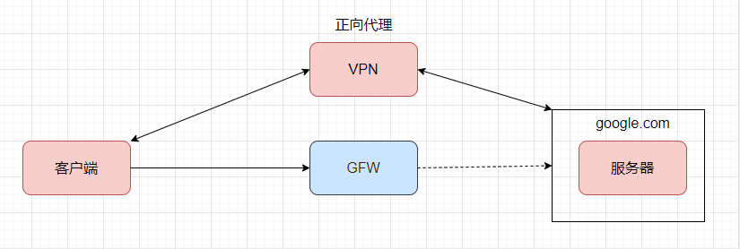
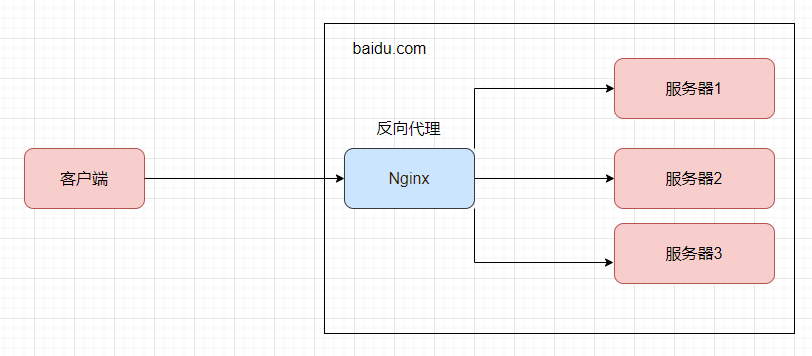
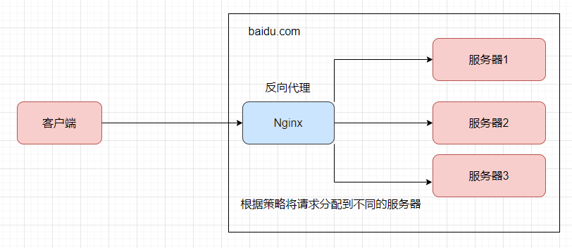

## Nginx简介

### 什么是Nginx

`Nginx ("engine x")`是一个高性能的`HTTP`和`反向代理`服务器，特点是占有内存少，并发能力强，` Nginx`专为性能优化而开发，性能是其最重要的考量，实现上非常注重效率，能经受高负载的考验，有报告表明能支持高达`50000`个并发连接数。

### 正向和反向代理

#### 正向代理

`正向代理` 作用于`客户端`，它隐藏了真实的客户端，服务端不知道真实的客户端是谁，客户端请求的服务都由代理服务器代替来请求 。比如`VPN`就是常见的正向代理，当我们需要访问某些网站，可能需要购买并配置`vpn`，客户端先访问`vpn`地址，`vpn`地址转发请求，并最后将请求结果原路返回。



#### 反向代理

`反向代理`是作用在`服务端`的，对于用户的一个请求，会转发到多个后端处理器中的一台来处理该具体请求。 就像客服电话的总线， 我们打同一个客服电话会被分配给不同的客服来处理，这个时候总线就是我们的`反向代理`。 `反向代理`隐藏了真实的服务端，当我们访问百度的时候，就像拨打客服热线一样，背后可能有成千上万台服务器为我们服务，但具体是哪一台，你不知道，也不需要知道，你只需要知道反向代理服务器是谁就好了，[baidu.com](https://www.baidu.com) 就是我们的反向代理服务器，反向代理服务器会帮我们把请求转发到真实的服务器那里去。 



### 负载均衡

 单个服务器解决不了，我们增加服务器的数量，然后将请求分发到各个服务器上,将原先请求集中到单个服务器上的情况改为将请求分发到多个服务器上,将负载分发到不同的服务器，也就是我们所说的`负载均衡 `。



## 安装

这里使用`docker-compose`安装，首先创建`docker-compose.yml`：

```yaml
version: '3.1'
services:
  nginx:
   restart: always
   image: nginx
   container_name: nginx
   ports:
     - 80:80
     - 443:443
   volumes:
     - /opt/nginx/conf.d:/etc/nginx/conf.d
     - /opt/nginx/cert:/etc/nginx/cert
```

然后使用`docker-compose up -d`命令启动`nginx容器`。

启动完成后，我们访问服务器的`80`端口，依然还是不能正常访问，因为我们没有编写任何的配置文件。

我们进入`/opt/nginx/conf.d`目录，我们简单编写一个配置文件`default.conf`：

```json
server{
  listen 80;
  server_name localhost;

  location / {
    root /usr/share/nginx/html;
    index index.html index.htm;
  }
}

```

然后回到`docker-compose.yml`的目录，使用`docker-compose restart`命令重启容器，然后访问，可以发现返回如下页面：


表示成功安装及运行。

## 配置文件

我们首先使用`docker ps`命令拿到`Nginx容器`的`ID`，然后使用`docker exec -it dc22cdfee2e4 bash`命令进入容器。

`Nginx`的配置文件默认放在`/etc/nginx`目录下，我们首先使用`cd /etc/nginx`进入目录，然后`cat nginx.conf`打开`nginx.conf`文件，这个文件是就是`Nginx`的核心配置文件，它的内容如下：

```json
# 从配置文件开始到events块之间的内容叫做全局块，主要会设置一些影响nginx服务器整体运行的配置指令，主要包括配置运行Nginx服务器的用户（组），运行生成的worker process数，进程PID存放路径、日志存放路径和类型以及配置文件的引入等。

# 语法格式： user username [group]
# username表示可以运行Nginx服务器的用户，group可选项表示运行Nginx服务器的用户组；只有被设置了用户或者用户组的成员才有权限启动Nginx进程。如果非这些用户就无法启动，还会报错。如果想所有的用户都可以启动这可以把当前行注释掉，或者使用user nobody （默认是注释掉的）
user  nginx;

# 语法格式：worker_process number | auto 
# number指定Nginx进程最多可以产生的worker process数量，默认配置是1，设置为auto时，Nginx进程将自动检测。
# 值越大，可以支持的并发量越多，但这个受软件，操作系统本身，还有硬件本身等制约，一般和cpu数量相等。
worker_processes  1;

# 语法 error_log  file/stderr [debug | info | notice | warn | error | crit | alert | emerg] ;
# 配置错误日志的存放路径。
# file表示文件；stderr 表示输出文件名称 ，后面[]中表示数据的日志级别，当设置某一个级别后，比这一级别高的都会被记录下来，比如设置warn后| error | crit | alert | emerg都会被记录下来。指定文件当前用户需要有写权限。
error_log  /var/log/nginx/error.log warn;

# 语法： pid  file
# 配置Nginx进程PID存放路径。
# file是指定存放路径和文件名称，可以放相对和绝对路径。
pid        /var/run/nginx.pid;

# events块 涉及的指令主要影响Nginx服务器和用户的网络连接。常用到的设置包括是否开启多worker process下的网络连接进行序列化，是否允许同时接收多个网络连接，选择何种时间驱动模型处理连接请求，每个worker process可以同时支持的最大连接数等。

events {
    # 用来开启work process 的最大连接数
    worker_connections  1024;
}


# http块 很重要，包含代理，缓存和日志定义等绝大部分功能和第三方模块的配置都可以放在这个模块中。配置的指令包含文件引入，MIME-Type的定义，日志定义，是否使用sendfile传输文件、连接超时时间，单链接请求数的上限等。
# http块中可以包含自己的全局块（http全局块），也可以包含多个server块，server块中又可以包含location块。

http {
    # include表示引入一个外部的文件
    # include指令可以放在配置文件的任何地方
    # 这里的mime.types中放着大量的媒体类型
    include       /etc/nginx/mime.types;
    # 默认的媒体类型为 application/actet-stream
    default_type  application/octet-stream;
	
    # 自定义服务日志格式
    log_format  main  '$remote_addr - $remote_user [$time_local] "$request" '
                      '$status $body_bytes_sent "$http_referer" '
                      '"$http_user_agent" "$http_x_forwarded_for"';

    # 自定义服务日志
    # 路径以及格式，这里的main就是log_format中指定的main
    access_log  /var/log/nginx/access.log  main;
	# 用于是否开启或者关闭传输文件
    sendfile        on;
    #tcp_nopush     on;
	
    # 和用户建立会话连接后，Nginx服务可以保持连接打开一段时间，指令keepalive_timeout用来设置这个时间
    keepalive_timeout  65;

    #gzip  on;
	
    # 引入了conf.d下的所有配置文件
    include /etc/nginx/conf.d/*.conf;
}

```

在上面的`nginx.conf`中，没有`server块`，但其实可以有`server块`，一个`http块`中可以包含多个`server块`，而每一个`server块`相当于一台虚拟主机，多个`server块`就可以使用一个`Nginx`进程来运行多个网站。

比如如下`server块`：

```json
server {
    # 代表Nginx监听的端口号，这里是80
    listen 80;
    # 代表Nginx接收请求的ip或host地址，这里是localhost
    server_name localhost;
    
    # location块
    # 请求的路径 这里表示localhost:80端口的/data路径
    # 语法格式：location [= | ~ | ~* | ^~]  uri  { ... }
    # uri可以使用正则
    # “=”  用于标准的uri(没有使用正则表达式等)前，要求请求字符串和uri严格匹配，如果匹配成功就停止搜索并立即处理请求，“~” 用于表示uri包含正则表达式，并且区分大小写，“~*”,用于表示uri包含正则表达式，并且不区分大小写。注意：如果包含uri正则表达式，必须使用“~” 或者 “~*” 标识。“^~” ,用于标准uri(没有使用正则表达式)，要求Nginx服务器找到表示uri和请求字符串匹配度最高的location后，立即使用location处理请求，而不使用location块中的正则uri和请求字符串做匹配。
    location /data {
    	# 配置请求的根目录
    	#接受到网络请求之后，首先需要在服务器端指定目录中寻找请求资源，指令root就是用来配置这个根目录的。比如请求/data下的index.html，会在/usr/share/nginx/html/data下寻找index.html文件。
    	# alias指令可以更改请求的URI，比如配置为alias /files时，请求/data下的index.html，则会直接在/files目录下寻找index.html。
  		root /usr/share/nginx/html;
    	# 指令index用来设置网站默认首页
    	index index.html index.htm;
  	}
}
```

## Nginx实现反向代理

比如我在服务器的`9200`端口上布置了一个`ElasticSearch`的服务，我们的目标就是通过`Nginx`将请求代理到这个服务。要实现反向代理自然是要修改配置文件，我们来到`/opt/nginx/conf.d`文件夹中，修改`default.conf`文件，当然，新建一个文件也是可以的：

```json
server{
    listen 80;
    server_name localhost;
    
    location / {
    	# proxy_pass指令在接收到指定请求后，将请求转发到哪个地址
		proxy_pass http://forexample:9200/;   
	}
}
```

然后返回`docker-compose.yml`文件目录，使用命令`docker-compose restart`重启。

直接访问服务器的`80`端口，发现已经可以直接显示出`ElasticSearch`服务的信息。

## Nginx的负载均衡

`Nginx`默认提供了三种负载均衡的策略：

- **轮询**：将客户端发起的请求，平均分配给每一台服务器。
- **权重**： 将客户端的请求，根据服务器权重值不同，分配不同的数量。
- **ip_hash**：基于发起请求的客户端的`ip`地址不同，始终会将请求发送到指定服务器上。

### 轮询

要实现`Nginx`轮询负载均衡，只需要在配置文件中添加以下内容：
```json
# 在server块外部增加upstream块
# proxy-name为自定义名称
# 有几台服务器就配置几个server
upstream proxy-name {
    server http://ip:port/;
    server http://op:port/;
}

server{
    listen 80;
    server_name localhost;
    
    location / {
    	# proxy_pass写上面的proxy-name
		proxy_pass http://proxy-name/;   
	}
}
```

### 权重

配置权重如下：

```json
# 在每个server后面增加weight=权重比例 即可
# 此时，6个请求，5个会走第一个server，1个会走第二个
upstream proxy-name {
    server http://ip:port/ weight=10;
    server http://op:port/ weight=2;
}

server{
    listen 80;
    server_name localhost;
    
    location / {
		proxy_pass http://proxy-name/;   
	}
}
```

### ip_hash

再次修改：

```json
upstream proxy-name {
    # 只需要在这里加 ip_hash 即可
    # 至于后面的权重，有没有都没关系
    ip_hash;
    server http://ip:port/ weight=10;
    server http://op:port/ weight=2;
}

server{
    listen 80;
    server_name localhost;
    
    location / {
		proxy_pass http://proxy-name/;   
	}
}
```

## 配置静态资源服务器

配置如下：

```json
location / {
    root 静态资源路径;
    index 默认访问路径下什么资源;
    autoindex on; # 展示静态资源全部内容，以列表的形式展开
}
```

但由于我们使用的是`docker`部署的`Nginx`，在此之前，我们需要修改`docker-compose.yml`配置，以使容器可以挂载外部数据卷，读取到外部的静态资源目录。

我们修改如下：

```yml
version: '3.1'
services:
  nginx:
   restart: always
   image: nginx
   container_name: nginx
   ports:
     - 80:80
     - 443:443
   volumes:
     - /opt/nginx/conf.d:/etc/nginx/conf.d
     - /data/static:/data/static
     - /opt/nginx/cert:/etc/nginx/cert
```

然后`docker-compose down`，删掉以前的容器，`docker-compose up -d`运行容器。

然后我们修改配置文件`/opt/nginx/conf.d/default.conf`：
```json
server{
  listen 80;
  server_name localhost;
  
  location /static {
    # 或者 alias /data/static;
    root /data;
  }

  location / {
    root /usr/share/nginx/html;
    index index.html index.htm;
  }
}
```
修改完之后`docker-compose restart`重启容器即可。