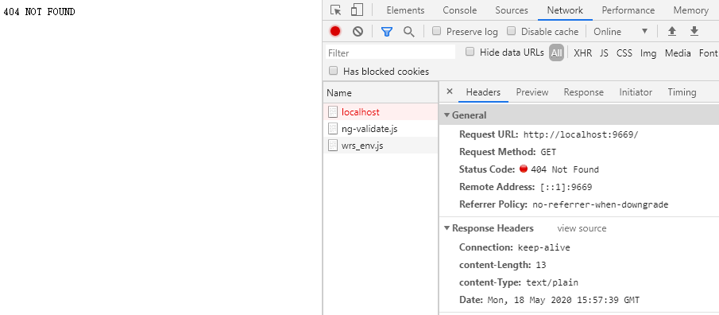

# 前言

`Koa`是一个基于`node.js`的`Web`框架。本文通过对`Koa`原理的学习，自己实现一个简单的玩具版`Koa`。

# 实现基本架构

首先创建一个`koa.js`,`Koa`的本体是一个类，我们在使用时会使用`new Koa()`创建一个实例，所以首先创造出一个`Koa`类并导出：

```js
class Koa {
    constructor() {
        
    }
}

module.exports = Koa;
```

# 实现Listen方法

`Koa`有一个`listen`方法，用来创建`http`连接并监听端口，我们创建这个方法，在里面直接调用`http`模块的`CreateServer`方法得到`server`，然后调用`server`的`listen`方法即可，这里我们只是对原生的方法做了一层包装而已：

```js
const http = require("http");

class Koa {
    constructor() {
        
    }
    //listen可以传递很多参数，这里我们直接使用拓展运算符即可
    listen(...args) {
        const server = http.createServer((req, res) => {});
        server.listen(...args);
    }
}

module.exports = Koa;
```

# 简单实现ctx上下文

`Koa`提供了`ctx`上下文环境，它的本质就是将`request`和`response`进行了合并，并通过`getter`和`setter`将自己的属性和`request`与`response`进行绑定。这里我只简单将`request`和`response`进行合并，不进行数据绑定：

```js
const http = require("http");

class Koa {
    constructor() {
        
    }
    
    listen(...args) {
        const server = http.createServer((req, res) => {});
        server.listen(...args);
    }
    //将req和res合并为ctx
    createContext(req, res) {
        const ctx = {
            req,
            res
        };
        return ctx;
    }
}

module.exports = Koa;
```


# 实现中间件

`Koa`可以使用中间件，当访问时会依次调用这些中间件。我们在创建时就创造一个数组用来保存中间件：

```js
const http = require("http");

class Koa {
    constructor() {
        //创建中间件数组
        this.middlewareList = [];
    }
    
    listen(...args) {
        const server = http.createServer((req, res) => {});
        server.listen(...args);
    }
    
    createContext(req, res) {
        const ctx = {
            req,
            res
        };
        return ctx;
    }
}

module.exports = Koa;
```

## 实现use

中间件通过`use`来使用，我们创建`use`方法，入参为中间件`middleware`，把这个中间件丢到中间件数组中即可：

```js
const http = require("http");

class Koa {
    constructor() {
        this.middlewareList = [];
    }
    
    listen(...args) {
        const server = http.createServer((req, res) => {});
        server.listen(...args);
    }
    
    createContext(req, res) {
        const ctx = {
            req,
            res
        };
        return ctx;
    }
    
    use(middleware) {
        //首先判断下传进来的中间件是不是一个函数
        if(typeof middleware !== "function") {
            throw new Error("middleware must be a function");
        }
        //把中间件push到数组中
        this.middlewareList.push(middleware);
    }
}

module.exports = Koa;
```

## 实现洋葱模型

`Koa`的中间件遵循洋葱模型，中间件会按照顺序层层包裹，每个中间件会收到一个`next`参数，当调用`next`函数时会调用下一个中间件。

洋葱模型的实现关键就在于`compose`函数，这个函数会将所有的中间件组合，具体实现如下：

```js
//用来组合中间件
//compose返回的不是中间件，而是一个传参为ctx的函数用来调用
function compose(middlewareList) {
  return (ctx) => {
    function dispatch(i) {
      const middleware = middlewareList[i];
      //当获取不到任何中间件时，直接返回
      if (!middleware) {
        return Promise.resolve();
      }
      try {
        return Promise.resolve(middleware(ctx, dispatch.bind(null, i + 1)));
      } catch (error) {
        return Promise.reject(error);
      }
    }
    //触发第一个中间件
    return dispatch(0);
  }
}
```

`compose`函数接收中间件数组，并返回一个入参为`ctx`的函数。

这个函数中定义了一个函数`dispatch`，`dispatch`的参数为一个序号`i`。里面拿到对应序号的中间件，并返回这个中间件。这个中间件的第一个参数为`ctx`上下文，第二个参数便是所谓的`next`，也就是`i + 1`个中间件（将这个中间件传递给当前中间件，就可以在当前中间件中调用）。用`Promise`包起来是为了外部`async await`。这个函数的最后，我们手动触发第一个中间件。

这个函数会被`compose`返回，注意，是返回这个函数，而不是这个函数的调用结果。这个函数会作为一个句柄用来调用，它的作用可以类比为一个链表的头部，当调用这个函数会直接触发第一个中间件，如果第一个中间件的`next`被调用会触发第二个中间件，以此类推。

最后我们需要手动触发第一个中间件`dispatch(0)`。

# 改造请求回调

我们首先把`createServer`的回调提取出来，然后新增一个方法用来调用中间件，为了方便理解，就叫做`callMiddleware`，`callMiddleware`接收两个参数，第一个为`ctx`上下文（之所以需要这个参数是因为需要传递给`compose`返回的函数），第二个参数是一个函数，目的是接收`compose`返回的句柄函数用来调用：

```js
const http = require("http");

class Koa {
    constructor() {
        this.middlewareList = [];
    }
    
    listen(...args) {
        const server = http.createServer(this.reqCb());
        server.listen(...args);
    }
    
    createContext(req, res) {
        const ctx = {
            req,
            res
        };
        return ctx;
    }
    
    use(middleware) {
        if(typeof middleware !== "function") {
            throw new Error("middleware must be a function");
        }
        this.middlewareList.push(middleware);
    }
    //用来触发中间件的函数
    callMiddleWare(ctx, fn) {
        
    }
    
    //提取为reqCb
    reqCb() {
        return (req, res) => {
            
        }
    }
}

module.exports = Koa;
```

我们在`reqCb`中调用`callMiddleware`，也就是开始调用中间件：

```js
const http = require("http");

class Koa {
    constructor() {
        this.middlewareList = [];
    }
    
    listen(...args) {
        const server = http.createServer(this.reqCb());
        server.listen(...args);
    }
    
    createContext(req, res) {
        const ctx = {
            req,
            res
        };
        return ctx;
    }
    
    use(middleware) {
        if(typeof middleware !== "function") {
            throw new Error("middleware must be a function");
        }
        this.middlewareList.push(middleware);
    }
    
    callMiddleware(ctx, fn) {
        
    }
    
    reqCb() {
        return (req, res) => {
            //首先自然是调用compose拿到句柄
            const fn = compose(this.middlewareList);
            //然后拿到ctx
            const ctx = this.createContext(req, res);
            //调用callMiddleware来调用中间件
            this.callMiddleware(ctx, fn);
        }
    }
}

module.exports = Koa;
```

最后，我们完善`callMiddleware`，也就是在里面调用句柄`fn`即可：

```js
const http = require("http");

class Koa {
    constructor() {
        this.middlewareList = [];
    }
    
    listen(...args) {
        const server = http.createServer(this.reqCb());
        server.listen(...args);
    }
    
    createContext(req, res) {
        const ctx = {
            req,
            res
        };
        return ctx;
    }
    
    use(middleware) {
        if(typeof middleware !== "function") {
            throw new Error("middleware must be a function");
        }
        this.middlewareList.push(middleware);
    }
    
    callMiddleware(ctx, fn) {
        //调用句柄（将ctx传入句柄）即可
        fn(ctx);
    }
    
    reqCb() {
        return (req, res) => {
            const fn = compose(this.middlewareList);
            const ctx = this.createContext(req, res);
            this.callMiddleware(ctx, fn);
        }
    }
}

module.exports = Koa;
```

# 完成

到这里一个简单的`Koa`其实就已经编写完成了，整体代码如下：

```js
const http = require("http");

function compose(middlewareList) {
  return (ctx) => {
    function dispatch(i) {
      const middleware = middlewareList[i];
      if (!middleware) {
        return Promise.resolve();
      }
      try {
        return Promise.resolve(middleware(ctx, dispatch.bind(null, i + 1)));
      } catch (error) {
        return Promise.reject(error);
      }
    }
    return dispatch(0);
  }
}

class Koa {
    constructor() {
        this.middlewareList = [];
    }
    
    listen(...args) {
        const server = http.createServer(this.reqCb());
        server.listen(...args);
    }
    
    createContext(req, res) {
        const ctx = {
            req,
            res
        };
        return ctx;
    }
    
    use(middleware) {
        if(typeof middleware !== "function") {
            throw new Error("middleware must be a function");
        }
        this.middlewareList.push(middleware);
    }
    
    callMiddleware(ctx, fn) {
        fn(ctx);
    }
    
    reqCb() {
        return (req, res) => {
            const fn = compose(this.middlewareList);
            const ctx = this.createContext(req, res);
            this.callMiddleware(ctx, fn);
        }
    }
}

module.exports = Koa;
```

# 测试

可以新建一个`test.js`来测试这个玩具版`Koa`是否可用，以及是否符合洋葱模型。

首先我们测试中间件不调用`next`是否会触发后面的中间件：

```js
const Koa = require("./koa");

const app = new Koa();

//中间件一
async function mid1(ctx, next) {
  console.log("this is the mid1!");
}

//中间件二
async function mid2(ctx, next) {
  console.log("this is the mid2!");
}

//分别调用这两个中间件
app.use(mid1);
app.use(mid2);

app.listen(9669);
```

使用`node test.js`启动，然后浏览器访问`localhost:9669`，控制台输出如下：

```bash
this is the mid1!
```

可以看到没有中间件没有使用`next`只调用了第一个中间件，而忽略了后面的中间件。


接下来测试使用`next`，并且测试是否符合洋葱模型：

```js
const Koa = require("./koa");

const app = new Koa();

//中间件一
async function mid1(ctx, next) {
  console.log("this is the mid1!");
  await next();
  console.log("mid1 end!");
}

//中间件二
async function mid2(ctx, next) {
  console.log("this is the mid2!");
  await next();
  console.log("mid2 end!");
}

//分别调用这两个中间件
app.use(mid1);
app.use(mid2);

app.listen(9669);
```

同上，启动然后浏览器访问，控制台输出：

```bash
this is the mid1!
this is the mid2!
mid2 end!
mid1 end!
```

可以看到，使用了`next`之后后面的中间件得到调用，并且中间件先入后出，符合洋葱模型。


最后测试在中间件中进行响应：

```js
const Koa = require("./koa");

const app = new Koa();

async function mid1(ctx, next) {
  console.log("this is the mid1!");
  await next();
  console.log("mid1 end!");
}

async function mid2(ctx, next) {
  console.log("this is the mid2!");
  await next();
  //在这里修改响应
  const body = "404 NOT FOUND";
  ctx.res.writeHead(404, {
    "content-Length": Buffer.byteLength(body),
    "content-Type": "text/plain"
  }).end(body);

  console.log("mid2 end!");
}

app.use(mid1);
app.use(mid2);

app.listen(9669);
```

结果如下，可以看到返回了状态码为`404`，内容为`404 NOT FOUND`，响应头字段内容也一致：



