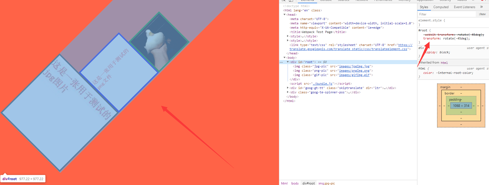

# Webpack学习

## 1. Webpack的安装

Webpack是基于node.js实现的模块打包工具，所以要使用Webpack就要先安装node.js。前往node的 [官网](https://nodejs.org/en/) 直接下载安装即可。安装好之后在命令行输入如下命令：

```bash

$ node -v
v10.16.3

$ npm -v
6.9.0


```

如果可以正确显示版本号则表示node已经正确安装。

接下来我们在桌面创建一个名为Webpack-demo的文件夹，进入这个文件夹，使用`npm init`去初始化一个npm项目，命令行会让输入一些信息，不想填写可以一路回车跳过，这时目录中会生成一个packge.json文件。

```bash
$ mkdir webpack-demo

$ cd webpack-demo

$ npm init


```

要在项目中安装Webpack需要在项目目录中使用`npm install webpack webpack-cli --sava-dev`或者`npm install webpack webpack-cli -D`命令，这时项目中就会安装好Webpack。这时我们继续在命令行输入`webpack -v`，发现无法找到webpack这个命令，这是因为直接使用webpack命令会在全局之中去寻找webpack，但是我们没有在全局安装webpack，要怎么解决这个问题呢？npm从5.2版本开始给我们提供了一个npx的命令，我们只需要在之前加上npx即可，如下：

```bash
$ npx webpack -v
4.40.2

```

这时正确输出了在项目中安装的webpack版本号，npx会帮助我们在当前项目中的node_modules的文件夹中去寻找webpack。

## 2. 使用Webpack的配置文件

Webpack是一个模块打包工具，尽管它有自己的默认配置，但是面对不同的打包需求，Webpack需要一个配置文件来配置应该如何打包。

如何编写Webpack的配置文件呢？我们需要在项目根目录创建一个`webpack.config.js`文件，文件的内容具体如下：

```js
//这里引入了一个node的核心模块'path'
const path = require('path');

//webpack配置文件需要导出一个对象，这个对象就是webpack的配置信息
module.exports = {
    entry: './index.js',    //entry配置打包的入口文件
    output: {               //output配置打包的出口
        filename: 'bundle.js',  //打包出的文件名
        path: path.resolve(__dirname, 'dist') //打包后的文件存放目录
    }
}
```

这里通过module.exports导出了一个对象，对象中entry用于配置webpack打包的入口文件。output配置打包的出口，filename配置打包生成的文件名，path则配置打包后存储的位置。我们文件开头引入了一个node模块“path”，这个模块是node.js中专门用来处理文件路径的。通过path的resolve方法我们指定了打包后的目录（resolve方法可以将多个路径解析为一个规范化的绝对路径并返回，其处理方式可以理解为对参数进行逐一进行CD操作），node中__dirname表示当前执行脚本所在目录的绝对路径，所以这里的配置为“打包入口为当前目录的index.js，出口为当前目录的dist文件夹，文件名为bundle.js”。

我们可以试着在项目根目录创建一个`index.js`文件，在里面随便写一些代码，比如就写一句

```js
console.log("Hello World!");
```

保存之后在命令行中输入`npx webpack`，这时根目录就会生成一个dist文件夹，里面有一个`bundle.js`文件，这就是打包完成后的文件夹和文件。

`npx webpack`这行命令会通过`webpack.config.js`配置进行打包，如果要指定配置文件，可以使用`npx webpack --config 配置文件`来进行打包。同时我们可以配置npm scripts来进行打包，在`package.json`中的scripts中配置命令，例如：


```javascript

"scripts": {

 	"bundle": "webpack"
	//...
  }

```


这里配置了一个名为bundle的脚本，脚本命令为运行webpack这个命令，这样只要在命令行运行`npm run bundle`就可以进行打包（在scripts中配置的脚本不需要npx，因为它会首先在工作目录的node_modules中寻找模块，而不是先在全局中寻找）。

查看打包后输出的信息，如下：

```bash
Hash: 865a083591c697b2e309
Version: webpack 4.40.2
Time: 128ms
Built at: 2019-09-14 1:54:37 PM
    Asset       Size  Chunks             Chunk Names
bundle.js  957 bytes       0  [emitted]  main
Entrypoint main = bundle.js
[0] ./index.js 28 bytes {0} [built]

WARNING in configuration
The 'mode' option has not been set, webpack will fallback to 'production' for this value. Set 'mode' option to 'development' or 'production' to enable defaults for each environment.
You can also set it to 'none' to disable any default behavior. Learn more: https://webpack.js.org/configuration/mode/
```

可以看到Chunk Names为main，这个main是哪里来的呢？实际上这是因为我们在编写配置文件时对入口文件进行了简写，如果我们的entry直接写了字符串，这个入口默认名字为main

```js
entry: {
    main: './index.js'
}
//和下面的写法相同
entry: './index.js'
```

在最下方有一行警告，这行警告是告诉我们在配置文件中没有配置打包的模式，查看打包出的`bundle.js`文件，可以看到所有代码都被压缩成了一行，这是因为当我们没有设置打包模式时默认模式是production模式，如果在配置文件中加上mode，就不会报警告了：

```js
module.exports = {
    mode: 'production',		//配置打包模式
   //...
}
```

但是设置为production后`bundle.js`文件依然和没设置时一样，如果不想代码被压缩，可以改成development。

我们在安装Webpack时同时安装了Webpack-cli,Webpack-cli的作用是什么呢？它使我们可以在命令行中正确地运行webpack这个命令，如果没有安装cli就无法在命令行中使用webpack命令。

## 3. 什么是loader

webpack是一个模块打包工具，但是模块不仅仅可以是js文件，也可以是图片、css等其他内容。但是webpack默认只知道打包处理js模块，而不知道其他的模块该如何打包，这时候我们就需要告诉webpack该怎么打包这些文件。该要怎么告诉他呢？答案是在配置文件中。

要让Webpack可以正确处理项目中不同类型的模块，需要在配置文件中增加module的配置：

```js
module.exports = {
  //...
  module: {               //这里表示当打包模块时来这里查看配置该如何打包各种类型的模块
        rules: [{     //rules配置匹配模块的规则，数组里的每一个对象都表示一个匹配规则
            test: /\.jpg$/,     //这里配置正则，如果模块是以jpg结尾的文件
            use: {              //就这样去打包
                loader: 'file-loader'       //使用file-loader这个loader来打包jpg图片
            }
        }]
    }
}
```

这里配置了file-loader，

>  那么loader到底是什么？loader是一种打包的规则，它告诉Webpack在遇到非js文件时该如何打包。

loader的使用如下：

- 使用test正则来匹配需要打包的文件
- 使用use来配置需要使用什么loader
- 如果一个类型的文件需要使用多个loader，使用一个数组来含括这些loader，webpack会 **从下到上** ，**从右到左** 依次调用


### 3.1 file-loader的使用

**file-loader可以将文件上的import / require（）解析为url，并将文件发送到输出目录中。**

由于用到了`file-loader`，所以需要先安装，使用`npm install file-loader -D`安装，接下来尝试在项目中去打包一个jpg文件。我们改变一下目录，在根目录新建一个src目录，把`index.js`丢进根目录中，同时改变一下配置文件的入口，并且在目录下新建一个images目录用来存放图片，随意丢一张图片进去测试，然后在index文件中导入它，运行打包命令，这时候已经可以正常打包。

```js
// webpack.config.js

module.exports = {
    entry: './src/index.js'
   //...
}
```

```js
// index.js
import jpgImg from './images/jpgImg.jpg';

console.log(jpgImg);
```

file-loader会将导入的文件打包到你配置的输出目录中，文件的命名默认情况下会使用文件的MD5。如果要改变输出文件的命名该怎么办呢？

**在使用loader时我们可以配置一些参数**，在loader下方添加options，比如我们需要不改变文件的名字：

```js
rules: [{
    test: /\.jpg$/,
    use: {
        loader: 'file-loader',
        options: {
            name: '[name].[ext]'	//配置占位符以修改文件名
        }
    }
}]
```

这时输出目录的文件就与本来的文件名相同了。这种配置的语法叫做**占位符**，常见的占位符有以下几个：

- [name] 表示文件本来的名字

- [hash] hash跟整个项目的构建相关，构建生成的文件hash值都是一样的，所以hash计算是跟整个项目的构建相关，同一次构建过程中生成的hash都是一样的，只要项目里有文件更改，整个项目构建的hash值都会更改

- [contenthash]表示由文件内容产生的hash值，内容不同产生的contenthash值也不一样

- [chunkhash] 表示它根据不同的入口文件(Entry)进行依赖文件解析、构建对应的chunk，生成对应的hash值。我们在生产环境里把一些公共库和程序入口文件区分开，单独打包构建，接着我们采用chunkhash的方式生成hash值，那么只要我们不改动公共库的代码，就可以保证其hash值不会受影响。

  由于采用chunkhash，所以项目主入口文件main.js及其对应的依赖文件main.css由于被打包在同一个模块，所以共用相同的chunkhash

- [ext] 表示文件本来的后缀

- 更多的占位符可以前往webpack官网的文档查看

如果要支持更多的图片格式打包，只要修改test的正则即可，比如：

```js
rules: [{
    test: /\.(jpg|png|gif)$/,	//修改正则匹配去匹配更多类型的文件
    use: {
        loader: 'file-loader',
        options: {
            name: '[name].[ext]'
        }
    }
}]
```

这样webpack就可以处理jpg、png、gif这样的文件了。

现在的文件都会被直接输出到输出目录的根目录中，如果我们的需求是**把文件输出到输出目录下的images目录中**，该如何操作呢？我们可以再添加一个outputPath的配置，这个参数可以配置想要将文件输出到哪:

```js
rules: [{
    test: /\.(jpg|png|gif)$/,
    use: {
        loader: 'file-loader',
        options: {
            name: '[name].[ext]',
            outputPath: 'images/'	//配置文件输出的目录，这里表示输出到输出目录的images下
        }
    }
}]
```


### 3.2 url-loader的使用

**url-loader除了能做file-loader的工作之外，它还能将文件转化为base64 URIs**

我们首先使用`npm install url-loader -D`安装url-loader，然后只要将配置文件的file-loader换成url-loader，其他不变，这时重新打包发现可以成功。但是我们发现输出目录下并没有images文件夹和文件，但是图片依然可以正常使用，这是因为url-loader已经将图片转化为base64放到了输出的js文件中。

但是这样使用url-loader是不合理的，虽然url-loader带来了一定的好处： 直接将文件存到了js文件中，减少了对于文件的http请求。但是带来的问题是什么呢？假如文件特别大，打包生成的js文件也会特别大，加载js的时间就会很长，这样的话页面很长时间都不能显示内容。

那么使用url-loader最佳的使用时机是什么？假如文件只有几KB，对js文件大小产生的作用极小的情况下使用url-loader是非常好的选择，没必要让几KB的文件再去发一次http请求，但是如果文件非常大那么使直接将文件输出到目录中是更好的选择。

那么怎么做到对不同大小的文件做不同的处理？只要在options中再加一个配置即可：

```js
rules: [{
    test: /\.(jpg|png|gif)$/,
    use: {
        loader: 'url-loader',
        options: {
            name: '[name].[ext]',
            outputPath: 'images/',	//配置文件输出的目录，这里表示输出到输出目录的images下
            limit: 2048		//当文件小于2048个字节（2KB）时，才转换为base63
        }
    }
}]
```


## 4. 如何打包样式文件

### 4.1 普通css文件

因为webpack本身只能打包js文件，所以样式文件时肯定不支持的，要打包样式文件就要使用对应的loader。打包css文件需要两个loader：`css-loader`和`style-loader`，我们先安装这两个loader：

```bash
npm install css-loader style-loader -D
```

然后修改配置文件

```js
rules: [{
    test: /\.(jpg|png|gif)$/,
    use: {
        loader: 'url-loader',
        options: {
            name: '[name].[ext]',
            outputPath: 'images/',	//配置文件输出的目录，这里表示输出到输出目录的images下
            limit: 2048		//当文件小于2048个字节（2KB）时，才转换为base63
        }
    }
},{
    test: /\.css$/,
    use: ['style-loader','css-loader']		//这里需要使用两个loader，多个loader要使用数组
}]
```

这时webpack已经可以打包样式文件了，那么这两个loader各自的作用是什么呢？

- 假如我们有多个css文件，`css-loader`可以帮助我们分析出这些css文件之间引用的关系，如`@import`和`url()`，并将这些css文件合并成一段css。
- 在得到`css-loader`生成的css之后，`style-loader`可以帮助我们将这段css挂载到页面的head之中。

### 4.2 stylus/sass/less等预处理器样式

如果想使用stylus、sass、less等预处理器，那么仅仅使用`css-loader`和`style-loader`是不够的，还需要使用每个预处理器专用的loader。

比如要使用stylus，需要先安装`stylus`和`stylus-loader`：

```bash
npm install stylus stylus-loader -D
```

修改配置文件：

```js
rules: [{
            test: /\.css$/,
            use: ['style-loader', 'css-loader']
        }, {
            test: /\.styl$/,
            use: ['style-loader', 'css-loader', 'stylus-loader'] //增加stylus-loader
        }]
```

这时我们可以一起测试一下这些loader的生效情况，首先在src目录下再创建一个style文件夹用于存放样式文件，在里面创建一个`index.css`文件和一个`pic-style.styl`文件，所有代码如下:

```js
//index.js

import jpgImg from './images/jpgImg.jpg';   //引入了一张jpg图片
import pngImg from './images/pngImg.png';   //引入了一张png图片
import gifImg from './images/gifImg.gif';   //引入了一张gif图片
import './style/index.css';         //引入了一个css文件
import './style/pic-style.styl';    //引入了一个styl文件

const root = document.getElementById('root');   //获取id为root的元素
const img1 = new Image();    //创建了一个img标签

img1.className = 'jpg-pic';      //将img标签的class设置为jpg-pic
img1.src = jpgImg;           //将img标签src设置为jpgImg

root.appendChild(img1);       //将img1标签插入root元素中


const img2 = new Image(); //创建了一个img标签

img2.className = 'png-pic'; //将img标签的class设置为png-pic
img2.src = pngImg; //将img标签src设置为pngImg

root.appendChild(img2); //将img2标签插入root元素中


const img3 = new Image(); //创建了一个img标签

img3.className = 'gif-pic'; //将img标签的class设置为gif-pic
img3.src = gifImg; //将img标签src设置为gifImg

root.appendChild(img3); //将img3标签插入root元素中
```

```js
//webpack.config.js

//这里引入了一个node的核心模块
const path = require('path');

//webpack配置文件需要导出一个对象，这个对象就是webpack的配置信息
module.exports = {
    mode: 'development',    //配置模式为开发模式
    entry: './src/index.js',    //entry配置打包的入口文件
    output: {               //output配置打包的出口
        filename: 'bundle.js',  //打包出的文件名
        path: path.resolve(__dirname, 'dist') //打包后的文件存放目录
    },
    module: {               //这里表示当打包模块时来这里查看配置该如何打包各种类型的模块
        rules: [{           //rules顾名思义，配置匹配模块的规则，这是一个数组，数组里的每一个对象都表示一个匹配规则
            test: /\.(jpg|png|gif)$/,     //这里配置正则，如果模块是以jpg结尾的文件
            use: {              //就这样去打包
                loader: 'url-loader',       //使用file-loader这个loader来打包jpg图片
                options: {
                    name: '[name].[ext]',   //使用占位符来定义输出文件名
                    outputPath: 'images/',      //配置文件输出目录，以输出目录为基点，这里表示dist下的images文件夹
                    limit: 1024     //当文件小于1024字节（1KB）才转换为base64
                }
            }
        }, {
            test: /\.css$/,
            use: ['style-loader', 'css-loader']
        }, {
            test: /\.styl$/,
            use: ['style-loader', 'css-loader', 'stylus-loader']
        }]
    }
}
```


```css
//index.css

body {
    background-color: tomato;
}
```

```stylus
//pic-style.styl

#root
    .jpg-pic
        width 300px
        height 300px
        border 5px solid #333
    .png-pic
        width 200px
        height 200px
        border 5px solid #00e
    .gif-pic
        width 150px
        height 150px
        border: 5px solid green
```

同时我们在dist目录下创建一个`index.html`：

```html
//index.html

<!DOCTYPE html>
<html lang="en">
<head>
    <meta charset="UTF-8">
    <meta name="viewport" content="width=device-width, initial-scale=1.0">
    <meta http-equiv="X-UA-Compatible" content="ie=edge">
    <title>Webpack Test Page</title>
</head>
<body>
    <div id="root"></div>
    <script src="./bundle.js"></script>
</body>
</html>
```


打包后打开`index.html`，最终效果如下：


可以看到不管是图片还是css或者styl，打包后都没有任何问题。

### 4.3 postcss-loader

有时候我们写一些css3样式的时候，需要根据不同的浏览器给css添加不同的厂商前缀，那么有没有可以帮助我们自动添加前缀的工具呢？`postcss-loader`就是一款可以实现这种功能的loader。

照常，安装；

```bash
npm i postcss-loader autoprefixer -D
```

和其他loader不同，`postcss-loader`需要我们在根目录创建一个`postcss.config.js`文件：

```js
module.exports = {
  plugins: [require('autoprefixer')]
}
```

这时我们需要修改一下配置文件：

```js
{
            test: /\.css$/,
            use: ['style-loader', 'css-loader', 'postcss-loader']
        }, {
            test: /\.styl$/,
            use: ['style-loader', 'css-loader', 'postcss-loader', 'stylus-loader']
        }
```

在使用`stylus-loader`等预处理器的loader时，需要将`postcss-loader`加在这些loader之前。

接下来我们给样式表添加一些样式，效果如下：



可以看到transform属性的前缀已经添加，并且样式也生效了。

### 4.4 importLoaders配置

在很多的脚手架工具里都可以看到importLoaders这个配置项，这个配置项是什么意思呢？

我们先在css-loader里配置importLoaders：

```js
{
            test: /\.styl$/,
            use: ['style-loader', {
            	loader: 'css-loader',
                options: {
                    importLoaders: 2
                }
            }, 'postcss-loader', 'stylus-loader']
        }
```

假如我们写了两个stylus文件，一个`index.styl`，一个叫`header.styl`，在`index.styl`中通过`@import`引入了`header.styl`，在js文件中直接引用的`index.styl`文件会依次调用`stylus-loader`、`postcss-loader`、`css-loader`、`style-loader`四个loader，但是对于在`index.styl`中通过`@import`引入的样式可能就不会走下面的两个loader了，而是直接从`css-loader`开始走了，如果希望在index.styl中引入的样式一样走下面两个loader，就需要在`css-loader`中使用importLoaders，配置为2则表示在`index.styl`引入的样式在引入之前也要往前先走两个loader。这样就可以保证不管是直接在js文件中引入的styl文件还是在styl中引入了styl文件，都会依次从下至上执行每个loader,就不会有问题了。

## 5. Webpack中的plugin
### 5.1 html-webpack-plugin
以前的`index.html`文件使我们手动在dist目录添加的，如果每次都需要我们手动去创建或者移动html文件那就太麻烦了，怎么解决这个问题呢？

在Webpack中，可以使用插件完成一定的事情，而htmlWebpackPlugin就是可以帮助我们生成html文件的一款插件。照例安装

```bash
npm i html-webpack-plugin -D
```

然后我们修改配置文件：

```js
const HtmlWebpackPlugin = require('html-webpack-plugin');   //引入html-webpack-plugin

module.exports = {
	//...
    plugins: [new HtmlWebpackPlugin()]
}
```
首先在配置文件中引入`html-webpack-plugin`，然后在导出对象中添加plugins这个key，value这个数组中new一个`HtmlWebpackPlugin`对象即可，保存后重新打包，输出目录下会生成如下`index.html`：
```html
<!DOCTYPE html>
<html>
  <head>
    <meta charset="UTF-8">
    <title>Webpack App</title>
  </head>
  <body>
  <script type="text/javascript" src="bundle.js"></script></body>
</html>
```
可以看到生成了html并且已经自动将生成的`bundle.js`文件引入。但是这个html文件一片空白，假如我们需要 在html文件中增加一个id为root的标签，现在的效果不能满足我们的需求。
要达到需要的效果，需要在配置中增加一个`template`的配置项，`template`顾名思义，就是可以定义我们的模板，我们可以在src目录下创建一个含有id为root的div标签的html文件，再将这个文件填入这个配置项：
```js
const HtmlWebpackPlugin = require('html-webpack-plugin');   //引入html-webpack-plugin

module.exports = {
	//...
    plugins: [new HtmlWebpackPlugin({
    	template: 'src/index.html'
    })]
}
```
这时我们重新打包，就可以看到会自动以这个模板生成了一个html，并且已经自动将生成的js文件引入了html文件中。

### 5.2 plugin的作用
好了，在使用`html-webpack-plugin`之后，我们可以总结下**plugin**的作用是什么？
> Plugin的作用就是： **在Webpack运行到某个时刻时，自动帮助我们去做一些事情。**
如同声明周期函数一样，都是在某一时刻会触发。
而`html-webpack-plugin`则会在**打包结束**这一时刻自动根据模板在输出目录生成对应的html文件，这个文件会引入打包出的js文件。

### 5.3 clean-webpack-plugin
假如我们改变了输出的文件名，将`bundle.js`改为`dist.js`，然后重新打包，这时候虽然能成功打包，但是我们会发现dist目录下会有两个js文件，一个是`bundle.js`，一个是`dist.js`，很显然，前者是上次打包留下的文件，虽然我们重新进行了打包，但是并没有清除上次残留的文件。
这时候我们希望在进行打包之时，会先将dist目录下的文件删除，然后再进行打包。要实现这个功能就要使用`clean-webpack-plugin`。照常安装：
```bash
npm i clean-webpack-plugin -D
```
在配置文件中导入`clean-webpack-plugin`，然后配置它：
```js
const HtmlWebpackPlugin = require('html-webpack-plugin');   
const { CleanWebpackPlugin } = require('clean-webpack-plugin');

module.exports = {
	//...
    plugins: [new HtmlWebpackPlugin({
    	template: 'src/index.html'
    }), new CleanWebpackPlugin()]
}
```
这样既可，在现版本的`clean-webpack-plugin`中，导入需要使用大括号解构，使用时不需要传参，它会默认删除所有输出目录下的文件。

## 6. Entry与Output的基本配置

在前面说过，Entry如果是以字符串的形式配置，并且没有设置Output，那么它的默认输出文件名为`main.js`，如果配置了Output，那么以Output的文件名为准。假设我们要将一个文件打包两次，配置如下：

```js
module.exports = {
    entry: {
        main: './src/index.js',
        sub: './src/index.js'
    },  
    output: {       
        filename: 'bundle.js',  
        path: path.resolve(__dirname, 'dist') 
    }
    //...
}
```

这个配置表示我们想要打包两次`index.js`，输出时一个叫`main.js`，一个叫`sub.js`，但是我们配置了出口，文件名为`bundle.js`，这是我们打包会报错`Multiple chunks emit assets to the same filename bundle.js (chunks main and sub)`，表示我们将多个模块打包为同一个文件名`bundle.js`，这样就命名冲突了。

要解决这个问题可以使用前面说到的占位符，修改如下：

```js
module.exports = {
    entry: {
        main: './src/index.js',
        sub: './src/index.js'
    },  
    output: {       
        filename: '[name].js',  
        path: path.resolve(__dirname, 'dist') 
    }
    //...
}
```

这样输出的文件就会以在entry中的配置名来生成，并且`html-webpack-plugin`会将两个文件都引入到html文件之中。

假如我们生成的js文件需要上传到CDN之上，这时候就需要在引入时添加CDN的域名，只需要在Output中增加一个配置项`publicPath`，如下：

```js
module.exports = {
    entry: {
        main: './src/index.js',
        sub: './src/index.js'
    },  
    output: {
        publicPath: 'https://cdn.com.cn',
        filename: '[name].js',  
        path: path.resolve(__dirname, 'dist') 
    }
    //...
}
```

重新打包，这时在html中引入了js文件就会在前面自动加上这个CDN的域名。


我们在配置文件中的`outPut`配置项中还经常看到`chunkFilename`这个配置，如下：

```js
module.exports = {
    output: {             
        filename: '[name].js',  //打包出的文件名
        chunkFilename: '[name].chunk.js',       //从入口文件分割出来的模块命名
        path: path.resolve(__dirname, '..', 'dist') //打包后的文件存放目录
    }
    //...
}
```

这时从入口文件分割出来的模块会以`chunkFilename`配置项来命名，而入口文件本身会以入口文件配置的key值作为命名。这时，html文件只会去引入入口文件直接导出的文件，而这些分割出来的模块是在这个文件中被间接引入到页面中去的。

## 7. SourceMap的配置

当我们代码写错时我我们可以通过chrome来查看我们代码写错的位置，我们这里故意写错一段代码来测试：

```js
//index.js
consale.log('Hello World');
```

然后打包，通过chrome查看：


这里它告诉我们是`main.js`的96行出错了，但这是显然不对的，我们只写了一行代码。这是因为它显示的是dist目录输出的代码，在这里第96行的确是这行错误的代码，那么怎么让它显示这个错误在源代码中的位置呢？可以通过配置SourceMap来解决这个问题。

> **SourceMap是一个映射关系，它知道dist目录下的`main.js`文件的96行实际上对应的是src目录下`index.js`文件中的第一行。**

要启用SourceMap，只需要在配置文件的增加一个配置项`devtool`，value为`source-map`即可。

```js
module.exports = {
    devtool: 'source-map'
	//...
}
```

重新打包后查看结果： 


打包时，dist目录下还会生成一个`main.js.map`文件，这个文件是source map的映射文件。当使用含有inline关键字的配置项时这个文件不会生成，但会以base64的形式插入到生成的js文件的底部；而cheap关键字则是让提示只提示行，而不用提示第几个字符，并且只会映射业务代码，而不去映射引入的第三方模块，比如loader等，如果想要映射第三方模块，则需要在后面增加module关键字；而eval是打包速度最快的一种形式，它不会生成映射文件，也不会将映射代码插入到js文件中，而是以eval的形式执行代码，并在后面以一个sourceURL指向入口文件，eval性能较高，但是针对比较复杂的情况下，它提示的内容可能不全面。

**devtool选项控制是否生成，以及如何生成 source map。**

下面是devtool的可配置项：

| devtool                        | 构建速度 | 重新构建速度 | 生产环境 | 品质                   |
| ------------------------------ | -------- | ------------ | -------- | ---------------------- |
| （none）                       | +++      | +++          | yes      | 打包后的代码           |
| eval                           | +++      | +++          | no       | 生成后的代码           |
| cheap-eval-source-map          | +        | ++           | no       | 转换过的代码（仅限行） |
| cheap-module-eval-source-map   | o        | ++           | no       | 原始源代码（仅限行）   |
| eval-source-map                | --       | +            | no       | 原始源代码             |
| cheap-source-map               | +        | o            | yes      | 转换过的代码（仅限行） |
| cheap-module-source-map        | o        | -            | yes      | 原始源代码（仅限行）   |
| inline-cheap-source-map        | +        | o            | no       | 转换过的代码（仅限行） |
| inline-cheap-module-source-map | o        | -            | no       | 原始源代码（仅限行）   |
| source-map                     | --       | --           | yes      | 原始源代码             |
| inline-source-map              | --       | --           | no       | 原始源代码             |
| hidden-source-map              | --       | --           | yes      | 原始源代码             |
| nosources-source-map           | --       | --           | yes      | 无源代码内容           |

> `+++` 非常快速, `++` 快速, `+` 比较快, `o` 中等, `-` 比较慢, `--` 慢

其中一些值适用于开发环境，一些适用于生产环境。对于开发环境，通常希望更快速的 source map，需要添加到 bundle 中以增加体积为代价，但是对于生产环境，则希望更精准的 source map，需要从 bundle 中分离并独立存在。

最佳实践： **如果在开发环境中去使用source map，建议使用`cheap-module-eval-source-map`，这种形式提示比较全同时打包速度也比较快；如果是线上环境，一般没有必要使用source map来映射，但是如果线上的代码出了问题需要快速定位问题，可以使用`cheap-module-source-map`，这样它的提示效果会更好一些。**

## 8. 使用WebpackDevServer提升开发效率

### 8.1 使用WebpackDevServer

开发中每次我们改变了我们的代码，我们都要手动地去打包一下，然后手动打开html，这样开发效率过于低下。我们有这样一个需求，如果我们改了src目录之下的源代码就会自动进行打包，然后我们直接去网页看效果就好了。实现这个功能有三种做法：

第一种：我们在`packge.json`的scripts中再增加一条指令，如下：

```js
"scripts": {
    "bundle": "webpack",
    "watch": "webpack --watch"	//增加的指令
}
```

在后面增加了`--watch`，运行`npm run watch`这时如果打包文件的内容发生了改变，webpack就会重新打包。

第一种做法还不够好，我们希望第一次使用`npm run watch`时，自动实现打包，同时浏览器可以自动打开，同时还可以模拟一些服务器上的特性，这时候就可以借助WebpackDevServer来满足更便利的需求，首先安装：

```bash
npm i webpack-dev-server -D
```

在配置文件中增加devServer的配置项：

```js
module.exports = {
	//...
    devServer: {
        port: 8080,	//端口号
        contentBase: './dist',	//要启动的服务器要启在哪个文件夹下，打包文件都在dist下，所以根路径为dist
        open: true	//自动打开浏览器
    }
}
```

在`package.json`的scripts中在增加一条指令：

```js
"scripts": {
    "bundle": "webpack",
    "watch": "webpack --watch",
     "start": "webpack-dev-server"	//增加的指令
}
```

启用指令，输出如下：

```bash
> webpack-dev-server

i ｢wds｣: Project is running at http://localhost:8080/
i ｢wds｣: webpack output is served from /
i ｢wds｣: Content not from webpack is served from ./dist
i ｢wdm｣: Hash: 5b71f2bee75a9a2044e9
Version: webpack 4.40.2
Time: 932ms
```

它告诉我们项目已经运行在了8080端口之上并且自动打开了浏览器，这时候只要打包文件发生了改变，webpack就会帮助我们重新打包，并且自动刷新浏览器。使用DevServer启动的项目打包之后的文件是不会放到dist目录中的，而是将文件保存在了内存中，提升打包速度。

为什么要通过服务器的形式来打开html呢？因为如果使用file协议来打开html文件，当我们发送Ajax时是不行的，使用devServer搭建的服务器地址在http协议上，就可以解决这个问题。

webpack有个配置项叫`proxy`，它可以帮助我们实现跨域的接口模拟，代码如下：

```js
module.exports = {
	//...
    devServer: {
        contentBase: './dist',	//要启动的服务器要启在哪个文件夹下，打包文件都在dist下，所以根路径为dist
        open: true，	//自动打开浏览器
        proxy: {
        '/api': 'http://localhost:3000'	//如果访问8080端口的api地址，就会自动转发到3000端口之上
    }
    }
}
```

WebpackDevServer更多配置项可查看[官方文档](https://webpack.js.org/configuration/dev-server/#devserver)。

### 8.2 Hot Module Replacement 模块热替换

#### 8.2.1 热模块替换（css）

启动了服务器之后，假如我们要实现一个功能，在页面上新增一个按钮，点击这个按钮页面上就会新增一个item，item的样式在写在css之中。本来item的颜色为红色，现在我们要改为蓝色，修改了css保存之后，DevServer检测到了代码的更新，就会刷新浏览器，之前生成的所有item就会消失。要解决这个问题就要使用DevServer的模块热替换功能：

```js
devServer: {
        contentBase: './dist',  //要启动的服务器要启在哪个文件夹下，打包文件都在dist下，所以根路径为dist
        open: true,     //自动打开浏览器
        hot: true,      //开启模块热替换
        hotOnly: true   //不支持模块热替换时不自动刷新
    }
```

只需要在devServer的配置项增加`hot: true`即可，一般会同时增加一个`hotOnly: true`，在某些模块不支持热更新的情况下，前者会自动刷新页面，后者不会刷新页面。同时我们注意到在文档中有这样的提示：

>  注意，必须有* [`webpack.HotModuleReplacementPlugin`](https://webpack.docschina.org/plugins/hot-module-replacement-plugin/) *才能完全启用 HMR。如果* `webpack` *或* `webpack-dev-server` *是通过* `--hot` *选项启动的，那么这个插件会被自动添加，所以你可能不需要把它添加到* `webpack.config.js` *中。关于更多信息，请查看* [HMR 概念](https://webpack.docschina.org/concepts/hot-module-replacement/) 页面。

所以，在plugins中添加`HotModuleReplacementPlugin`：

```js
const Webpack = require('webpack');		//HotModuleReplacementPlugin官方自带，无需安装，引入webpack即可
module.exports = {
    //...
    devServer: {
        contentBase: './dist',  //要启动的服务器要启在哪个文件夹下，打包文件都在dist下，所以根路径为dist
        open: true,     //自动打开浏览器
        hot: true,      //开启模块热替换
        hotOnly: true   //不支持模块热替换时不自动刷新
    },
    plugins: [new HtmlWebpackPlugin({ template: 'src/index.html' }), 
              new CleanWebpackPlugin(),
              new Webpack.HotModuleReplacementPlugin()
             ]
}
```

这时候重启服务器，热模块替换已经生效了，更改css后不会自动刷新浏览器，也不会修改用js渲染的内容，但是改变的css效果已经改变了。


#### 8.2.2 热模块替换（js）

热模块替换在修改js时也有同样的效果，如果不使用热模块替换，当一个模块的内容发生改变时，页面就会刷新从而影响另一个模块渲染的内容，而使用了热模块替换，各个模块之间的修改不会影响其他模块的内容，从而方面调试。

我们新建两个js文件`counter.js`和`number.js`，代码如下：

```js
// counter.js
export default () => {
    const oDiv = document.createElement('div');
    oDiv.innerText = 1;
    oDiv.onclick = () => {
        oDiv.innerText = Number(oDiv.innerText) + 1;
    }
    document.body.appendChild(oDiv);
}
```

```js
// number.js
export default function Number() {
    const oDiv = document.createElement('div');
    oDiv.id = 'number';
    oDiv.innerText = 3000;
    document.body.appendChild(oDiv);
}
```

```js
//index.js
import counter from './counter';
import number from './number';
counter();
number();
```

启动页面，这时页面就会显示两个div，值分别是1和1000，点击1时数字会加一。我们先把这个div的数字点击为任意数字，然后去`number.js`中将1000修改为3000，这时候我们发现虽然页面并没有刷新，但是1000并没有变成3000，这时候我们需要手写一段代码：

```js
//index.js
import counter from './counter';
import number from './number';

counter();
number();
//新增如下代码
if(module.hot) {
    module.hot.accept('./number', () => {
        document.body.removeChild(document.getElementById('number'));
        number();
    })
}
```

如果已经通过 [`HotModuleReplacementPlugin`](https://github.com/docschina/webpack.js.org/blob/cn/plugins/hot-module-replacement-plugin) 启用了[模块热替换(Hot Module Replacement)](https://github.com/docschina/webpack.js.org/blob/cn/concepts/hot-module-replacement)，则它的接口将被暴露在 [`module.hot` 属性](https://github.com/docschina/webpack.js.org/blob/cn/api/module-variables#module-hot-webpack-specific-)下面。通常，用户先要检查这个接口是否可访问，然后再开始使用它。而accept方法接受(accept)给定`依赖模块`的更新，并触发一个 `回调函数` 来对这些更新做出响应。

实例这行代码的意思是：如果`module.hot`属性存在，则接受`./number`模块的更新，当number更新时，触发后面的回调函数，函数里先是移除了本来的div，然后重新挂载了一个div，从而不影响`counter`渲染的内容。

那么为什么css文件不需要写这么一段代码就可以实现HMR的效果呢？实际上css使用了`css-loader`，它已经帮助我们实现了这样一段代码。而vue等脚手架也可以实现HMR的效果，而且不用自己书写这样的代码，主要是它的loader已经在内部实现了。

>  最后：**永远不要**在生产环境(production)下启用 HMR。

## 9. 使用Babel处理ES6语法

我们如果直接在项目中编写ES6的代码，虽然可能在新版的Chrome或者火狐上已经没什么问题了，但是在一些老版本的浏览器以及IE或者一些国产浏览器上是不能直接运行的。这就需要我们将ES6的代码转化成ES5的代码，Babel就是一款能将ES6的代码转换为ES5代码的工具。

要使用Babel，首先安装：

```bash
npm i babel-loader @babel/core -D
```

> `babel-loader`很明显，是帮助webpack打包的工具；而`@babel/core`则是babel的核心库，它能识别js代码里的内容，将语法转换为抽象语法树（AST）。

然后在配置文件中增加`babel-loader`的配置：

```js
module: {
  rules: [
    { test: /\.js$/,
     exclude: /node_modules/, 	//排除node_modules里的文件
     loader: 'babel-loader' }
  ]
}
```

这时我们需要再安装`@babel/preset-env`，因为虽然我们已经配置好了Babel，但是我们还没有让它做任何事情，还需要一些插件来做一些事情，而`@babel/preset-env`是babel的一个预设插件，把需要转换的ES6语法插件集合在一起，它包含了大部分ES6语法转ES5的规则。

```bash
npm install @babel/preset-env -D
```

然后在配置文件中配置：

```js
module: {
  rules: [
    { test: /\.js$/,
     exclude: /node_modules/, 	//排除node_modules里的文件
     loader: 'babel-loader',
     options: {
         presets: ['@babel/preset-env']		//接收一个数组，数组中写插件名字即可
     }
    }
  ]
}
```

编写`index.js`用于测试：

```js
const arr = [
    new Promise(() => {}),
    new Promise(() => {})
]

arr.map(item => {
    console.log(item);
})

```

这时使用`npx webpack`打包，查看打包出的文件，会发现已经可以将ES6的代码转换为ES5的代码，比如const已经变成了var，箭头函数变成了普通函数。但是还不够，因为Promise这样新的语法，map这样的方法，在低版本的浏览器里依然是不存在的。这时不仅需要使用`@babel/preset-env`做语法的转换，还需要将一些缺失的变量以及方法补充到低版本浏览器里，`@babel/polyfill`正好可以实现：

```bash
npm i @babel/polyfill -S
```

然后在使用ES6语法的模块里导入`@babel/polyfill`即可，如下：

```js
import '@babel/polyfill';
const arr = [
    new Promise(() => {}),
    new Promise(() => {})
]

arr.map(item => {
    console.log(item);
})
```

这时，babel已经可以将ES6的内容都转化为ES5了。

我们查看打包文件，发现和没引入polyfill时相比，大小已经从29.4KB增长为934KB，这是因为我们将polyfill的所有代码都打包进了我们的代码中。在这里我们只是使用了Promise和map这两个语法，而polyfill里其它的实现我们都不需要，怎么做到按需引入？修改配置文件如下：

```js
module: {
  rules: [
    { test: /\.js$/,
     exclude: /node_modules/, 	//排除node_modules里的文件
     loader: 'babel-loader',
     options: {
         presets: [['@babel/preset-env', {
             useBuiltIns: 'usage'	//字符串改成数组，第一项为preset名字，第二项为配置
         }]]		
     }
    }
  ]
}
```

将useBuiltIns设置为usage即可按需引入，这样修改之后我们可以将`index.js`中引入polyfill的代码删掉，因为使用了useBuiltIns之后已经不需要了。重新打包，发现文件只有147KB了，说明按需引入已经成功了。

`@babel/preset-env`还支持其他的参数，比如targets，这定义了代码运行的环境，如下：

```js
module: {
  rules: [
    { test: /\.js$/,
     exclude: /node_modules/, 	//排除node_modules里的文件
     loader: 'babel-loader',
     options: {
         presets: [['@babel/preset-env', {
             useBuiltIns: 'usage',	//字符串改成数组，第一项为preset名字，第二项为配置
             targets: {
                 chrome: 56,			//可以与browserslist结合，用它的写法
                 fixfox: 60				//确定代码运行在chrome版本大于56，firefox版本大于60的浏览器上
             }
         }]]		
     }
    }
  ]
}
```

这时重新打包，会发现文件大小又变回了29.4KB，查看打包后的代码发现并没有进行转换，因为这定义的这两个浏览器的版本都已经支持了这些语法了，如果用户浏览器低于这些版本，是不能运行的。

Webpack打包会根据你targets设定的值，去can i use这个网站查询这些版本是否已经支持用到的语法，如果都支持那就不转换了，如果不支持就转换。

如果只是写业务代码可以使用`@babel/polyfill`，但是如果写的是一个类库，更推荐使用[`@babel/plugin-transform-runtime`](https://www.babeljs.cn/docs/babel-plugin-transform-runtime)，因为`@babel/polyfill`会污染全局环境，而`@babel/plugin-transform-runtime`则不会有这个问题，具体使用可以查看[文档](https://www.babeljs.cn/docs/babel-plugin-transform-runtime)。

最后，Babel的配置项可以单独创建一个文件来编写，在项目根目录下创建`.babelrc`文件，然后将options整个对象移动到这个文件之中即可。

## 10. 对React框架代码进行打包

React是前端最流行的框架，想要对React框架的代码进行打包同样需要使用`Babel`。首先我们安装`@babel/preset-react`以解析React中的`jsx`代码：

```bash
npm install @babel/preset-react -D
```

同时我们安装React这个框架：

```bash
npm install react react-dom -S
```

然后在项目根目录下的`.babelrc`文件中修改如下：

```json
{
    "presets": [
        ["@babel/preset-env", {
            "useBuiltIns": "usage", 
            "targets": {
                "chrome": 58,
                "firefox": 60 
            }
        }],
        "@babel/preset-react"
    ]
}
```

这里的意思是，Babel先用`@babel/preset-react`转换React的代码，然后使用`@babel/preset-env`将ES6的代码转换为ES5的代码。`preset`的执行是有顺序的，为 `从下往上，从右往左 ` 。

babel的配置已经完毕了，接下来写一段React的代码：

```js
//index.js
import React, { Component } from 'react';
import ReactDOM from 'react-dom';

class APP extends Component {
    render() {
        return (
            <div>Hello World</div>
        )
    }
}

ReactDOM.render(<APP/>, document.getElementById('root'));

```

重启DevServer服务器，发现页面已经可以正常运行。

## 11. Tree shaking概念详解

> 所谓`Tree shaking`，其实中文翻译一下，就是所谓“摇树”的意思，而在Webpack中`Tree shaking`就是和“摇树”一样，去摇需要打包的JS文件，将其中用不到的代码摇掉。

我们在项目中导入JS文件时，假如一个文件中有`add`和`minus`两个函数，虽然我们只导入并使用了`add`函数，但是打包后依然会将整个文件的代码都进行打包，这将极大地增大打包文件的大小。整个文件相当于一棵树，而`add`只是这棵树的一小部分，我们只需要这一小部分，就可以使用Webpack的`Tree shaking`将不需要的部分摇掉。

> `Tree shaking`只支持`ES Module`。`ES Module`是静态导入的方式，而`CommonJS`是动态导入的方式，`Tree shaking`只支持静态导入。

怎么实现`Tree shaking`呢？

配置文件中，如果我们的模式是`development`，默认是没有`Tree shaking`的功能的。在配置文件中我们需要增加一个`optimization(优化)`的配置，如下：

```js
module.exports = {
    mode: 'development',    //模式为开发模式
    //...
    optimization: {
        usedExports: true
    }
}
```

然后在`package.json`中增加`"sideEffects": false`：

```json
//package.json
{
    //...
    "sideEffects": false
}
```

那么`"sideEffects": false`这个配置是什么意思呢？

如果我们配置了`Tree shaking`，那么所有的导入项Webpack都通过`Tree shaking`的方式来导入，假如我们导入的是类似`@babel/polyfill`这样的模块，它是通过在window上挂载一些全局变量，而实际上没有直接导出模块，这时候假如用了`Tree shaking`，它发现这个模块没有导出任何内容，就可能在打包时直接忽略掉了。设置为false是表示不对任何模块跳过`Tree shaking`流程，如果我们需要跳过某个模块的`Tree shaking`，需要这样配置，写一个数组，然后将这个模块填进去：

```json
//package.json
{
    //...
    "sideEffects": ["@babel/polyfill", "*.css"]
}
```

这时候打包会发现代码依然没有将`minus`去掉，这是因为在开发模式下，`Tree shaking`实际上是没效果的，因为为了方便调试，比如`source-map`等这些因素，如果使用了`Tree shaking`会使代码的行数发生改变不方便调试。

而在`production`生产环境下，Webpack已经有了默认的配置，默认开启了`Tree shaking`，所以不需要写`usedExports`。


> 个人认为，`Tree shaking`不需要配置，因为开发模式不生效，生产模式已经自动开启，包括`package.json`文件也不需要配置。假如把`sideEffects`设置为`false`，那么css文件都会被shaking掉，这不是我们想要的结果，所以不设置，使用Webpack的默认配置即可。

## 12.  Development和Production模式区分打包

Webpack分为`Development模式`和`Production模式`，对应开发环境和生产环境。开发环境中，我们可以配置一些工具来帮助我们更方便地进行开发，比如DevServer，而DevServer还集成了HMR这样的功能。但是项目一旦开发完成，需要将代码打包上线，就需要使用`Production模式`，两者差异主要在以下方面：

- `Development模式`的`source-map`非常全，这样可以在开发中快速定位我们的问题；`Production模式`模式的`source-map`更简洁，没那么重要。
- `Development模式`的代码不需要压缩以查看打包内容，方便我们调试；`Production模式`下的代码需要被压缩。

如果要改变打包模式，反复修改配置文件显然不是很合适，现在我们将配置文件`webpack.config.js`改名为`webpack.dev.js`，代表是开发模式的配置；然后在根目录再新增一个配置文件`webpack.prod.js`，代表是生产模式的配置。把`webpack.dev.js`中的所有文件拷贝到`webpack.prod.js`之中，要修改的地方有以下几处：

- 将`mode`改为`production`，表示生产 环境。
- 将`devtool`修改为`cheap-module-source-map`，去掉`eval`。
- 将`DevServer`整个配置项去掉，线上环境不需要。
- 将`plugins`中的`HotModuleReplacementPlugin`插件去掉，线上不用HMR。

我们可以在根目录新建一个目录`build`，然后将两个配置文件放到里面。这时我们发现两个配置文件有许多重复的配置项，如果修改公共的配置需要两边都修改，非常麻烦，怎么将公共的配置提取出来呢？使用一个npm的包`webpack-merge`可以解决这个问题，首先安装：

```bash
npm install webpack-merge -D
```

在`build目录`创建一个`webpack.common.js`用于存放公共代码，修改后三个文件对应的代码如下：

```js
//webpack.common.js

//这里引入了一个node的核心模块
const path = require('path');

const HtmlWebpackPlugin = require('html-webpack-plugin');   //引入html-webpack-plugin
const { CleanWebpackPlugin } = require('clean-webpack-plugin'); //引入clean-webpack-plugin

module.exports = {
    entry: {
        main: './src/index.js'
    },    //entry配置打包的入口文件
    output: {               //output配置打包的出口
        filename: '[name].js',  //打包出的文件名
        path: path.resolve(__dirname, '..', 'dist') //打包后的文件存放目录
    },
    module: {               //这里表示当打包模块时来这里查看配置该如何打包各种类型的模块
        rules: [{           //rules顾名思义，配置匹配模块的规则，这是一个数组，数组里的每一个对象都表示一个匹配规则
            test: /\.(jpg|png|gif)$/,     //这里配置正则，如果模块是以jpg结尾的文件
            use: {              //就这样去打包
                loader: 'url-loader',       //使用file-loader这个loader来打包jpg图片
                options: {
                    name: '[name].[ext]',   //使用占位符来定义输出文件名
                    outputPath: 'images/',      //配置文件输出目录，以输出目录为基点，这里表示dist下的images文件夹
                    limit: 1024     //当文件小于1024字节（1KB）才转换为base64
                }
            }
        }, {
            test: /\.css$/,
            use: ['style-loader', 'css-loader', 'postcss-loader']
        }, {
            test: /\.styl$/,
            use: ['style-loader', {
                loader: 'css-loader',
                options: {
                    importLoaders: 2
                }
            }, 'postcss-loader', 'stylus-loader']
        },
        {
            test: /\.js$/,
            exclude: /node_modules/,    //不包含node_modules里的文件
            loader: 'babel-loader'      //使用babel-loader
        }
    ]
    },
    plugins: [
        new HtmlWebpackPlugin({
            template: 'src/index.html'
        }),
        new CleanWebpackPlugin()
    ]
}
```

```js
//webpack.dev.js

const Webpack = require('webpack');         //HotModuleReplacementPlugin官方自带，无需安装，引入webpack即可。
const merge = require('webpack-merge');
const commonConfig = require('./webpack.common');

const devConfig = {
    mode: 'development',    //配置模式为开发模式
    devtool: 'cheap-module-eval-source-map',  
    devServer: {
        contentBase: './dist',  //要启动的服务器要启在哪个文件夹下，打包文件都在dist下，所以根路径为dist
        open: true,     //自动打开浏览器
        hot: true,      //开启模块热替换
        hotOnly: true   //不支持模块热替换时不自动刷新
    },
    plugins: [
        new Webpack.HotModuleReplacementPlugin()
    ]
} 

module.exports = merge(commonConfig, devConfig);
```

```js
//webpack.prod.js

const merge = require('webpack-merge');
const commonConfig = require('./webpack.common');

const prodConfig = {
    mode: 'production',    //配置模式为生产模式
    devtool: 'cheap-module-source-map'
}

module.exports = merge(commonConfig, prodConfig);
```

可以看到我们将共有的配置项都剥离了出来，然后两个模式的配置文件分别使用merge这个模块将配置项进行合并，如果我们增加或修改公共的配置就直接修改`webpack.common.js`即可，单独的就配置单独的配置文件。

> 需要注意的是，由于改变了文件目录，这时候输出目录进行了更改，变成了`path.resolve(__dirname, '..', 'dist')`，表示上一层目录的dist，因为如果不修改，生成的dist目录会在build文件夹之下。但是入口文件不需要修改，因为命令是在根目录下运行的，以运行命令的路径为参考点。

然后我们还要在`package.json`新增两条脚本命令，如下：

```json
{
  "scripts": {
    "dev": "webpack-dev-server --config ./build/webpack.dev.js",
    "build": "webpack --config ./build/webpack.prod.js"
  }
}

```

其中，`dev`代表开发模式，会启动DevServer；`build`代表打包线上模式，会在dist目录生成打包过后的文件。指定配置文件使用`--config`指令。

## 13. 代码分割（Code Splitting）

### 13.1 代码分割的简单使用

> 代码分割（Code Splitting）就是把一个大文件，分割成小块，让浏览器并行加载代码，从而提升首次加载速度。

代码分割不是Webpack独有的概念，如果要进行代码分割，我们可以手动将文件分割成多个JS文件，然后在页面中引入即可。

在webpack中手动分割，可以在`entry`中配置多个入口，比如我们要使用`lodash`这个库，就可以将它单独列为一个文件，然后在`entry`中配置即可：

```js
module.exports = {
    entry: {
        main: './src/index.js',
        lodash: './src/lodash.js'
    }
}
```

这样打包就会生成两个文件，然后分别引入到`html`之中。

但是这样做不够智能，在Webpack中有了自带的插件来帮助我们进行代码分割，在配置文件中的`optimization`增加`splitChunks`：

```js
//webpack.common.js
module.exports = {
    //...
    optimization: {
        splitChunks: {
            chunks: 'all'
        }
    }
}
```

这时我们的`index.js`文件如下：

```js
//index.js
import _ from 'lodash';

console.log(_.join(['a', 'b', 'c'], ''));
```

重新打包，会发现dist目录下除了`main.js`，还多了一个`vendors~main.js`，这个文件中已经将`lodash`这个库单独提取出来了。

除了上面这种同步载入的分割，Webpack也支持异步载入的分割，如下：

```js
//index.js
function getComponent() {
    return import('lodash').then(_ => {
        const element = document.createElement('div');
        element.innerText = _.join(['a', 'b', 'c'], '');
        return element;
    })
}

getComponent().then(element => {
    document.body.appendChild(element);
});
```

重新打包，dist目录下除了`main.js`，还生成了一个`0.js`，`lodash`代码已经被提取到了这个文件里。实际上异步载入即使我们不写配置文件，Webpack也会帮助我们进行代码分割，提取到一个单独的文件里。

> 总结：
>
> - 同步代码： 只需要在`webpack.common.js`中做`optimization`的配置即可。
> - 异步代码（import异步导入）： 不需要任何配置，会自动进行代码分割。

### 13.2 SplitChunksPlugin配置

#### 13.2.1 magic comment（魔法注释）

我们通过异步加载的代码进行打包后生成的文件是一个`0.js`，这是Webpack进行代码分割产生的`id值`，如果我们需要对这个文件进行命名，就需要使用`magic comment`：

```js
//index.js
function getComponent() {
    return import(/* webpackChunkName:"lodash" */ 'lodash').then(_ => {
        const element = document.createElement('div');
        element.innerText = _.join(['a', 'b', 'c'], '');
        return element;
    })
}

getComponent().then(element => {
    document.body.appendChild(element);
});
```

可以看到我们在引入 的时候加了一段注释，意思这个模块使用webpack打包时名字叫做`lodash`，然后重新打包，会看到生成的文件名变成了`vendors~lodash.js`，这时候的文件名依然不叫`lodash`，我们还需要修改一个配置项：

```js
//webpack.common.js
module.exports = {
    //...
    optimization: {
        splitChunks: {
            chunks: 'all',
            cacheGroups: {
                vendors: false,
                default: false
            }
        }
    }
}
```

再重新打包，这时候的文件名已经为`lodash.js`。

### 13.2.2 splitChunks参数详解

如果我们将splitChunks的配置改为一个空对象：

```js
//webpack.common.js
module.exports = {
    //...
    optimization: {
        splitChunks: {}
    }
}
```

这时候打包依然可以进行代码分割，因为Webpack有默认的参数，当使用空对象时就使用默认的参数，默认参数如下：

```js
splitChunks: {
    chunks: "async",
    minSize: 30000,
    minChunks: 1,
    maxAsyncRequests: 5,
    maxInitialRequests: 3,
    automaticNameDelimiter: '~',
    name: true,
    cacheGroups: {
        vendors: {
            test: /[\\/]node_modules[\\/]/,
            priority: -10
        },
    	default: {
            minChunks: 2,
            priority: -20,
            reuseExistingChunk: true
        }
    }
}
```

参数的意义如下：

- `chunks`： 这里的`async`表示只对异步导入进行分割，所以webpack默认对同步代码是不进行分割的；如果要对同步和异步的代码都进行代码分割，需要将配置项改为`all`并且需要和`cacheGroup`搭配使用；如果只需要打包同步代码，将配置项改为`initial`同时和`cacheGroup`搭配使用，关于`cacheGroup`配置项下面会讲。
- `cacheGroup(仅作用于同步代码)`：`cacheGroup`名为缓存组，是`splitChunks`分组的核心配置，如果`chunks`配置为`initial`或者`all`，那么打包时会将代码进行分组分割，我们可以看到配置项默认有两个分组`vendors`和`default`，`vendors`的`test`配置了会将所有所有来自`node_modules`的模块分到一组，这时整个组的模块会被逐一缓存，最终打包生成文件名为`vendor~mian.js`，`main`表示入口文件为`main`，如果想要重命名，则需要在`vendors`配置中增加`filename`配置项，比如设置为`vendors.js`，这时打包的vendor分组同步代码就会分割到`vendors.js`之中。而配置中的`priority`则表示权重，我们引入的模块例如`lodash`，符合`vendors`的要求，又符合`default`的要求，因为`default`根本就没有`test`，所以的同步代码都符合`default`要求，那么文件就要根据`priority`来分析放到哪个组，数值越大权重越高，比如`-10`比`-20`大，那么就会优先放到`vendors`这个组中。
- `minSize`： 进行代码分割的最小模块大小，假如设置为30000，那么只有引入的模块大于30000字节时，Webpack才会进行代码分割。
- `maxSize`： 对分割后依然大于此值的模块尝试进行二次代码分割，假如设置为50000，则会对分割后大于50000字节的模块尝试进行代码分割。
- `minChunks`：打包生成的`chunks`中有多少个引用了这个模块，大于等于此次数才进行代码分割，如果设置为1，就表示引用次数大于等于一次就分割。
- `maxAsyncRequests`： 同时加载的模块数最多是5个。假如我们引入了10个类库，会分割成10个代码文件，打开浏览器会加载10个代码文件，这样会导致非常多的请求。这个参数如果配置为5，那么打包时会将前五个进行代码分割，后面的就不进行代码分割了。
- `maxInitialRequest`： 入口文件进行代码分割最多分割成多少个文件，如果设置为3，则入口文件最多被分割为3个文件。
- `automaticNameDelimiter`： 分割后的文件名的连接符，设置为`~`，则**组和文件名**的连接符号为波浪号。
- `name`： `cacheGroup`的组中的`filename`配置的文件名是否生效。
- `reuseExistingChunk`： 中文解释是复用已存在的模块。意思是，如果有一个`a.js`文件，它里面引用了`b.js`，但我们其他模块又有引用`b.js`的地方。开启这个配置项后，在打包时会分析`b.js`已经打包过了，直接可以复用不用再次打包。

## 14. Lazy Loading懒加载

> 所谓懒加载，就是通过异步代码引入，在页面开始载入时不加载，而是在合适的时机进行加载。

下面是一段异步加载的代码：

```js
function getComponent() {
    return import(/* webpackChunkName:"lodash" */ 'lodash').then(_ => {
        const element = document.createElement('div');
        element.innerText = _.join(['a', 'b', 'c'], '');
        return element;
    })
}


document.addEventListener('click', () => {
    getComponent().then(element => {
        document.body.appendChild(element);
    });
});
```

这段代码中，我们给页面添加了一个点击事件，点击时会调用`getComponent`，而这个函数会异步加载`lodash`这个库。我们打包会生成一个`main.js`和一个`vendors~lodash.js`，页面载入时只会载入`index.html`以及`main.js`，只有当我们点击页面的任何位置才会去加载`vendors~lodash.js`，从而渲染`abc`，这就做到了异步加载文件。

在`ES7`已经支持`async await`的语法，可以简化我们的代码，上面的代码可以写成：

```js
async function getComponent() {
    const _ = await import(/* webpackChunkName:"lodash" */ 'lodash')
    const element = document.createElement('div');
    element.innerText = _.join(['a', 'b', 'c'], '');
    return element;
}


document.addEventListener('click', () => {
    getComponent().then(element => {
        document.body.appendChild(element);
    });
});

```


## 15. 代码分析，Preload，Prefetch

### 15.1 代码分析

我们可以使用webpack官方提供的工具对打包进行分析，我们可以在[Webpack analyze](https://github.com/webpack/analyse)查看使用方法，修改打包命令如下：

```json
//package.json
"build": "webpack --profile --json > bundleStates.json --config ./build/webpack.prod.js"
```

可以看到配置了`--profile --json > the analyze name.json`,这样打包时就会生成一个打包分析的文件。

然后我们打开这个[网站](http://webpack.github.com/analyse),将这个文件上传即可查看。

这只是官方提供的工具，还有第三方的工具，比如：

- [webpack-chart](https://alexkuz.github.io/webpack-chart/): webpack 数据交互饼图。
- [webpack-visualizer](https://chrisbateman.github.io/webpack-visualizer/): 可视化并分析你的 bundle，检查哪些模块占用空间，哪些可能是重复使用的。
- [webpack-bundle-analyzer](https://github.com/webpack-contrib/webpack-bundle-analyzer): 一款分析 bundle 内容的插件及 CLI 工具，以便捷的、交互式、可缩放的树状图形式展现给用户。

### 15.2 Prefetch

> **什么是prefetch？**
>
> 这种“资源提示” 告诉浏览器这是一个在未来**可能**使用到的资源。
>
> 浏览器通常会在空闲状态取得这些资源，在取得资源之后搁在HTTP缓存以便于实现将来的请求。如果有多个‘预请求提示’则会在浏览器空闲时排队执行。当浏览器离开空闲状态时正好在‘预请求’资源，那么浏览器会取消任何正在进行中的请求（同时会将部分响应数据放置在缓存中，而在Header中继续使用Content-Range字段 ）并停止处理‘预请求’队列。
>
> 总之:在闲置时获取资源

怎么使用`Prefetch`呢？

需要使用魔法注释`webpackPrefetch: true`，如下：

```js
async function getComponent() {
    const _ = await import(/* webpackChunkName:"lodash", webpackPrefetch: true */ 'lodash')
    const element = document.createElement('div');
    element.innerText = _.join(['a', 'b', 'c'], '');
    return element;
}
```

魔法注释也可以分开写，如`/* webpackChunkName:"lodash" */ /* webpackPrefetch: true */`这样的形式。

实际上`Prefetch`帮助我们在html的`head`中添加了如下内容：

```html
<link rel="prefetch" as="script" href="vendors~lodash.js">
```


> **什么是preload？**
>
> 这种“资源提示” 告诉浏览器这是一种在这次导航中必须的资源，只是会在之后才会被使用， chrome甚至会在资源加载后3秒没有被使用时打印一个警告.
>
> 浏览器通常以中等优先级（非布局阻塞）获取此资源。
>
> 总之：正常获取，及早发现

`Preload`的使用方法和`prefetch`类似，只要将关键字修改即可。

## 16. css文件的代码分割

将css文件进行分割需要使用一个插件`MiniCssExtractPlugin`，首先安装这个插件：

```js
npm install --save-dev mini-css-extract-plugin
```

然后修改配置文件：

```js
const MiniCssExtractPlugin = require('mini-css-extract-plugin');

module.exports = {
  	module: {
        rules: [{
            test: /\.css$/,
            use: [MiniCssExtractPlugin.loader, 'css-loader', 'postcss-loader']
        }, {
            test: /\.styl$/,
            use: [MiniCssExtractPlugin.loader, {
                loader: 'css-loader',
                options: {
                    importLoaders: 2
                }
            }, 'postcss-loader', 'stylus-loader']
        },]
    }
    plugins: [
        new HtmlWebpackPlugin({
            template: 'src/index.html'
        }),
        new CleanWebpackPlugin(),
        new MiniCssExtractPlugin({
            filename: '[name].css',
            chunksFilename: '[name].chunks.css'
        })
    ]
}
```

可以看到我们将以前使用的`style-loader`替换成了`MiniCssExtractPlugin.loader`，换成了这个plugin自带的loader，然后我们使用了这个插件。配置项里可以填写一些参数，具体可见文档。

如果要对生成的css文件进行压缩，需要借助一个插件`optimize-css-assets-webpack-plugin`，首先进行安装：

```bash
npm install --save-dev optimize-css-assets-webpack-plugin
```

然后在线上配置文件中配置如下：

```js
const OptimizeCSSAssetsPlugin = require('optimize-css-assets-webpack-plugin');

const prodConfig = {
    optimization: {
        minimizer: [new OptimizeCSSAssetsPlugin({})]
    }
}


```

此时再次打包，会发现css文件的代码已经自动合并与压缩。


## 17. Webpack与浏览器缓存（Caching）

我们把项目上线，用户在访问页面时会去加载打包后的文件然后进行缓存，假如在这期间我们重新进行了打包，然后把同样文件名的文件替换上线，这时用户刷新页面，浏览器发现请求的文件在本地已经有了缓存，就会直接使用缓存里的文件，这样会导致线上的代码不能同步更新。

要解决这个问题可以在线上模式的配置文件中进行修改：

```js
//webpack.prod.js

const prodConfig = {
    output: {
        filename: '[name].[contenthash].js', 
        chunkFilename: '[name].[contenthash].js'
    }
}
```

使用占位符，如果文件内容发生了改变，文件就会生成不同的hash值，从而改变文件命名导致不同，让浏览器加载。


## 18. Webpack Shimming

### 18.1 Shimming的使用

`webpack` 编译器`(compiler)`能够识别遵循`ES2015`模块语法、`CommonJS`或 `AMD`规范编写的模块。然而，一些第三方的库可能会引用一些全局依赖（例如 `jQuery`中的`$`）。这些库也可能创建一些需要被导出的全局变量。这些“不符合规范的模块”就是 `shimming`发挥作用的地方，在`webpack`中，每个库文件是单独的，彼此隔离的；如下面的代码：

```js
//jquery.ui.js
export function ui () {
  $('body').css('background', 'red')
}
```

我们新建了一个`jquery.ui.js`，使用了`jquery`但是并没有引入它。

然后我们修改入口文件，在入口文件中引入`jquery`(安装步骤略过)，然后引入`jquery.ui.js`，测试一下打包文件是否能运行：

```js
//index.js
import $ from 'jquery';
import { ui } from './jquery.ui';

ui();

const dom = $('<div/>');
dom.html('hello world');
$('body').append(dom);
```

在我们的一般印象中，这段代码应该是可以运行的，我们在上部分引入了`jquery`，它会在全局有一个`$`变量，然后在下方导入的文件中使用了`jquery`，应该也是可行的。但是当我们打包打开html文件后，会提示`$ is not defined at ui (jquery.ui.js:2)`。在`Webpack`中是基于模块打包的，模块之中的变量只能在模块这一个文件之中被使用，而换了一个文件再想使用上一个文件中的变量是不行的。

我们一般引入的库文件是第三方的，存放在`node_module`中，我们也不可能去修改它里面的内容，所以这时候就需要使用`Shimming`来解决问题；修改我们的`webpack.common.js:new webpack.ProvidePlugin`，这个`webpack`自带的插件会进行对打包文件进行检查，如果检测到你的代码中有`$`这个符号，他会自动帮你引入`jquery`模块。然后将`jquery`模块赋值给`$`字符串。

```js
//webpack.common.js
const Webpack = require('webpack');

module.exports = {
    plugins: [
        new Webpack.ProvidePlugin({
            $: 'jquery'
        })
    ]
}
```

### 18.2 利用Shimming改变模块中this指向window

一个模块中的`this`的指向是什么？我们知道在浏览器环境中如果没有明确调用目标，`this`指向的是全局对象`window`，那么模块中的`this`是不是指向`window`？我们修改入口文件，如下：

```js
console.log(this === window);
```

输出后发现是`false`，实际上在`webpack`的模块中，`this`指向的是这个模块自身，如果想要让每个模块的`this`都指向`window`，就需要`imports-loader`这个`loader`解决：

```bash
npm i imports-loader -D
```

然后修改配置文件：

```js
module.exports = {
    module: {           
        rules: [{
            test: /\.js$/,
            exclude: /node_modules/,
            use: [{ loader: 'babel-loader'},{loader: 'imports-loader?this=>window'}]
        	}
    	]
    }
}
```

这时重新打包，上面的输出已经为`true`。

## 19. 环境变量的使用方法

现在我们的三个配置文件分别为`webpack.common.js`、`webpack.dev.js`、`webpack.prod.js`，在`webpack.dev.js`和`webpack.prod.js`中导出的都是通过`merge`融合过后的对象，现在我们可以改写一下我们的配置文件：

```js
//webpack.dev.js

const Webpack = require('webpack');         //HotModuleReplacementPlugin官方自带，无需安装，引入webpack即可。

const devConfig = {
    mode: 'development',    //配置模式为开发模式
    devtool: 'cheap-module-eval-source-map',
    output: {
        filename: '[name].js',  //打包出的文件名
        chunkFilename: '[name].chunk.js',       //从入口文件分割出来的模块命名
    },
    devServer: {
        contentBase: './dist',  //要启动的服务器要启在哪个文件夹下，打包文件都在dist下，所以根路径为dist
        open: true,     //自动打开浏览器
        hot: true,      //开启模块热替换
        hotOnly: true   //不支持模块热替换时不自动刷新
    },
    plugins: [
        new Webpack.HotModuleReplacementPlugin()
    ]
} 

module.exports = devConfig;
```

```js
//webpack.prod.js

const OptimizeCSSAssetsPlugin = require('optimize-css-assets-webpack-plugin');

const prodConfig = {
    mode: 'production',    //配置模式为生产模式
    devtool: 'cheap-module-source-map',
    output: {
        filename: '[name].[contenthash].js', 
        chunkFilename: '[name].[contenthash].js'
    },
    optimization: {
        minimizer: [new OptimizeCSSAssetsPlugin({})]
    }
}

module.exports = prodConfig;
```

```js
//这里引入了一个node的核心模块
const path = require('path');

const HtmlWebpackPlugin = require('html-webpack-plugin');   //引入html-webpack-plugin
const { CleanWebpackPlugin } = require('clean-webpack-plugin'); //引入clean-webpack-plugin
const MiniCssExtractPlugin = require('mini-css-extract-plugin');
const Webpack = require('webpack');
const merge = require('webpack-merge');
const prodConfig = require('./webpack.prod');
const devConfig = require('./webpack.dev');

const commonConfig = {
    entry: {
        main: './src/index.js'
    },    //entry配置打包的入口文件
    output: {               //output配置打包的出口
        path: path.resolve(__dirname, '..', 'dist') //打包后的文件存放目录
    },
    module: {               //这里表示当打包模块时来这里查看配置该如何打包各种类型的模块
        rules: [{           //rules顾名思义，配置匹配模块的规则，这是一个数组，数组里的每一个对象都表示一个匹配规则
            test: /\.(jpg|png|gif)$/,     //这里配置正则，如果模块是以jpg结尾的文件
            use: {              //就这样去打包
                loader: 'url-loader',       //使用file-loader这个loader来打包jpg图片
                options: {
                    name: '[name].[ext]',   //使用占位符来定义输出文件名
                    outputPath: 'images/',      //配置文件输出目录，以输出目录为基点，这里表示dist下的images文件夹
                    limit: 1024     //当文件小于1024字节（1KB）才转换为base64
                }
            }
        }, {
            test: /\.css$/,
            use: [MiniCssExtractPlugin.loader, 'css-loader', 'postcss-loader']
        }, {
            test: /\.styl$/,
            use: [MiniCssExtractPlugin.loader, {
                loader: 'css-loader',
                options: {
                    importLoaders: 2
                }
            }, 'postcss-loader', 'stylus-loader']
        },
        {
            test: /\.js$/,
            exclude: /node_modules/,    //不包含node_modules里的文件
            use: [
                {
                    loader: 'babel-loader'
                },
                {
                    loader: 'imports-loader?this=>window'
                }
            ]
        }
    ]
    },
    plugins: [
        new HtmlWebpackPlugin({
            template: 'src/index.html'
        }),
        new CleanWebpackPlugin(),
        new MiniCssExtractPlugin({
            filename: '[name].css',
            chunkFilename: '[name].chunk.css'
        }),
        new Webpack.ProvidePlugin({
            $: 'jquery'
        })
    ],
    optimization: {
        splitChunks: {
            chunks: 'all'
        }
    }
}

module.exports = (env) => {
    if(env && env.production ) {
        return merge(commonConfig, prodConfig);
    } else {
        return merge(commonConfig, devConfig);
    }
}
```

我们将`webpack.dev.js`和`webpack.prod.js`中的`webpack-merge`删除掉了，并且直接导出的是本身，而不是融合后的对象，而在`webpack.common.js`中我们引入`webpack-merge`以及`devConfig`和`prodConfig`，最后我们导出的是一个函数，而不是一个对象，这个函数的返回值根据传入的`env`决定，如果有传入`env`以及`env.production`，那么就表明是线上环境，返回融合的线上环境配置；否则，返回融合的开发环境配置。

那么问题来了，怎么传入这个`env`变量呢？我们修改一下`package.json`的脚本命令：

```json
{
   //...
  "scripts": {
    "dev": "webpack-dev-server --config ./build/webpack.common.js",
    "build": "webpack --env.production --config ./build/webpack.common.js",
    "dev-build": "webpack --config ./build/webpack.common.js"
  },
}

```

可以看到我们在`build`这条命令里加了一条参数`--env.production`，这条参数表示传入一个参数`env`，默认值为`production`，这样就可以传递入`env`参数，然后使用线上环境配置进行打包。而其他两条由于没有传递参数，所以没有`env`，也就会走`else`这个条件，使用开发环境的配置进行打包。

这三条命令的用处分别是：

- `dev`： 使用开发环境配置打包，并通过`webpack-dev-server`启动一个服务器方便调试。
- `dev-build`：使用开发环境配置打包，但是不通过`webpack-dev-server`启动服务器，因为通过`webpack-dev-server`启动服务器打包的文件不生成在输出目录，而是保存在内存中，不方便我们查看，
- `build`：使用线上环境配置打包，会开启代码压缩等一系列优化的方式。

